# Unreal Engine Editor Icons

In this doc repository, you'll find all icons defined in the default UE4 Editor Slate Style and their names associated.

> I do not own these icons, they are here for illustration purpose. All Rights goes to Epic Games.

## Where are icons defined ?

Icons are defined in the UE4 Editor Slate Style in the file [`SlateEditorStyle.cpp`](https://github.com/EpicGames/UnrealEngine/blob/release/Engine/Source/Editor/EditorStyle/Private/SlateEditorStyle.cpp) of the source code.
Icons are copied from an installed version of Unreal engine 4.22 in the subdirectory `C:\Program Files\Epic Games\UE_4.22\Engine\Content\Editor\Slate`
## Related Tools

* [Texture Browser Unreal Plugin](https://github.com/hannesdelbeke/texture-browser-unreal-plugin) Resource browser

## Icons

* `Checkerboard` 
* `WideDash.Horizontal` 
* `WideDash.Vertical` 
* `ThinLine.Horizontal` 
* `Symbols.SearchGlass` 
* `Symbols.X` 
* `Symbols.UpArrow` 
* `Symbols.DoubleUpArrow` 
* `Symbols.DownArrow` 
* `Symbols.DoubleDownArrow` 
* `Symbols.RightArrow` 
* `Symbols.Check` 
* `Icons.Cross` 
* `Icons.Denied` 
* `Icons.Error` 
* `Icons.Help` 
* `Icons.Info` 
* `Icons.Warning` 
* `Icons.Download` 
* `Icons.Refresh` 
* `Icons.Contact` 
* `WarningStripe` 
* `ComboButton.Arrow` 
* `HelpIcon` 
* `HelpIcon.Hovered` 
* `HelpIcon.Pressed` 
* `ProgressBar.Marquee` 
* `WhiteTexture` 
* `Editor.AppIcon` 
* `GenericLock` 
* `GenericLock.Small` 
* `GenericUnlock` 
* `GenericUnlock.Small` 
* `GenericPlay` 
* `GenericPause` 
* `GenericStop` 
* `SoftwareCursor_Grab` 
* `SoftwareCursor_CardinalCross` 
* `SoftwareCursor_UpDown` 
* `GenericViewButton` 
* `GenericLink` 
* `ExpandableButton.Collapsed` 
* `ExpandableButton.Expanded_Left` 
* `ExpandableButton.Expanded_Center` 
* `ExpandableButton.Expanded_Right` 
* `ExpandableButton.CloseButton` 
* `ContentReference.FindInContentBrowser` 
* `ContentReference.UseSelectionFromContentBrowser` 
* `ContentReference.PickAsset` 
* `ContentReference.Clear` 
* `ContentReference.Tools` 
* `SystemWideCommands.FindInContentBrowser` 
* `SystemWideCommands.FindInContentBrowser.Small` 
* `DialogueWaveDetails.SpeakerToTarget` 
* `Checker` 
* `TreeArrow_Collapsed` 
* `TreeArrow_Collapsed_Hovered` 
* `TreeArrow_Expanded` 
* `TreeArrow_Expanded_Hovered` 
* `SpinBox.Arrows` 
* `Throbber.Chunk` 
* `Throbber.CircleChunk` 
* `SmallThrobber.Chunk` 
* `CurveEd.TimelineArea` 
* `CurveEd.FitHorizontal` 
* `CurveEd.FitVertical` 
* `CurveEd.CurveKey` 
* `CurveEd.CurveKeySelected` 
* `CurveEd.Tangent` 
* `CurveEd.TangentSelected` 
* `CurveEd.Visible` 
* `CurveEd.VisibleHighlight` 
* `CurveEd.Invisible` 
* `CurveEd.InvisibleHighlight` 
* `CurveEd.Locked` 
* `CurveEd.LockedHighlight` 
* `CurveEd.Unlocked` 
* `CurveEd.UnlockedHighlight` 
* `MessageLog.Action` 
* `MessageLog.Docs` 
* `MessageLog.Error` 
* `MessageLog.Warning` 
* `MessageLog.Note` 
* `MessageLog.Tutorial` 
* `MessageLog.Url` 
* `MessageLog.TabIcon` 
* `AnimEditor.RefreshButton` 
* `AnimEditor.VisibleEye` 
* `AnimEditor.InvisibleEye` 
* `AnimEditor.FilterSearch` 
* `AnimEditor.FilterCancel` 
* `AnimEditor.NotifyGraphBackground` 
* `BlendSpace.SamplePoint` 
* `BlendSpace.SamplePoint_Highlight` 
* `BlendSpace.SamplePoint_Invalid` 
* `AnimEditor.EditPreviewParameters` 
* `AnimEditor.EditPreviewParameters.Small` 
* `GammaReference` 
* `TrashCan` 
* `TrashCan_Small` 
* `Log.TabIcon` 
* `OutputLog.OpenSourceLocation` 
* `OutputLog.OpenInExternalEditor` 
* `DebugTools.TabIcon` 
* `PerfTools.TabIcon` 
* `Modules.TabIcon` 
* `ClassViewer.TabIcon` 
* `BlueprintDebugger.TabIcon` 
* `CollisionAnalyzer.TabIcon` 
* `DeveloperTools.MenuIcon` 
* `AutomationTools.MenuIcon` 
* `SessionBrowser.SessionLocked` 
* `SessionBrowser.StatusRunning` 
* `SessionBrowser.StatusTimedOut` 
* `SessionBrowser.Terminate` 
* `SessionConsole.SessionCopy` 
* `SessionConsole.SessionCopy.Small` 
* `SessionConsole.Clear` 
* `SessionConsole.Clear.Small` 
* `SessionConsole.SessionSave` 
* `SessionConsole.SessionSave.Small` 
* `SessionFrontEnd.TabIcon` 
* `SessionFrontEnd.Tabs.Tools` 
* `Launcher.TabIcon` 
* `Launcher.Tabs.Tools` 
* `UndoHistory.TabIcon` 
* `InputBindingEditor.Tab` 
* `InputBindingEditor.AssetEditor` 
* `InputBindingEditor.AssetEditor` 
* `InputBindingEditor.GenericCommands` 
* `InputBindingEditor.FoliageEditMode` 
* `InputBindingEditor.LandscapeEditor` 
* `InputBindingEditor.LayersView` 
* `InputBindingEditor.LevelEditor` 
* `InputBindingEditor.LevelViewport` 
* `InputBindingEditor.MainFrame` 
* `InputBindingEditor.OutputLog` 
* `InputBindingEditor.PlayWorld` 
* `PackageRestore.FolderOpen` 
* `SavePackages.SCC_DlgCheckedOutOther` 
* `SavePackages.SCC_DlgNotCurrent` 
* `SavePackages.SCC_DlgReadOnly` 
* `Layer.Icon16x` 
* `Layer.VisibleIcon16x` 
* `Layer.NotVisibleIcon16x` 
* `LayerStats.Item.ClearButton` 
* `LayerCloud.Item.ClearButton` 
* `LayerBrowser.ExploreLayerContents` 
* `LayerBrowser.ReturnToLayersList` 
* `LayerBrowser.Actor.RemoveFromLayer` 
* `SceneOutliner.FilterSearch` 
* `SceneOutliner.FilterCancel` 
* `SceneOutliner.FolderClosed` 
* `SceneOutliner.FolderOpen` 
* `SceneOutliner.NewFolderIcon` 
* `SceneOutliner.MoveToRoot` 
* `SceneOutliner.World` 
* `SocketIcon.Bone` 
* `SocketIcon.Socket` 
* `SocketIcon.None` 
* `MatineeRecorder.Record` 
* `MatineeRecorder.Stop` 
* `GraphBreadcrumb.BrowseBack` 
* `GraphBreadcrumb.BrowseForward` 
* `GraphBookmarkMenuImage.Button_Add` 
* `BreadcrumbTrail.Delimiter` 
* `NotificationList.SuccessImage` 
* `NotificationList.FailImage` 
* `NotificationList.DefaultMessage` 
* `AssetEditor.SaveAsset.Greyscale` 
* `AssetEditor.SaveAsset` 
* `AssetEditor.SaveAsset.Small` 
* `AssetEditor.SaveAssetAs` 
* `AssetEditor.SaveAssetAs.Small` 
* `AssetEditor.ReimportAsset` 
* `AssetEditor.ReimportAsset.Small` 
* `AssetThumbnail.AssetBackground` 
* `AssetThumbnail.ClassBackground` 
* `AssetThumbnail.DataOnlyBPAssetBackground` 
* `SystemWideCommands.SummonOpenAssetDialog` 
* `MainFrame.AutoSaveImage` 
* `GenericCommands.Undo` 
* `GenericCommands.Redo` 
* `MainFrame.SaveAll` 
* `MainFrame.ChoosePackagesToSave` 
* `MainFrame.NewProject` 
* `MainFrame.OpenProject` 
* `MainFrame.AddCodeToProject` 
* `MainFrame.Exit` 
* `MainFrame.CookContent` 
* `MainFrame.PackageProject` 
* `MainFrame.RecentProjects` 
* `MainFrame.RecentLevels` 
* `MainFrame.FavoriteLevels` 
* `EditorPreferences.TabIcon` 
* `ProjectSettings.TabIcon` 
* `CodeView.ClassIcon` 
* `CodeView.FunctionIcon` 
* `AboutScreen.Background` 
* `AboutScreen.Facebook` 
* `AboutScreen.FacebookHovered` 
* `AboutScreen.UE4` 
* `AboutScreen.UE4Hovered` 
* `AboutScreen.EpicGames` 
* `AboutScreen.EpicGamesHovered` 
* `Credits.Pause` 
* `Credits.Play` 
* `NewLevelDialog.Blank` 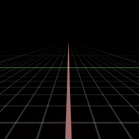
* `NewLevelDialog.Default` 
* `FoliageEditToolBar.Icon` 
* `FoliageEditToolBar.Expand` 
* `FoliageEditToolBar.SubMenuIndicator` 
* `FoliageEditMode.SetPaint` 
* `FoliageEditMode.SetReapplySettings` 
* `FoliageEditMode.SetSelect` 
* `FoliageEditMode.SetLassoSelect` 
* `FoliageEditMode.SetPaintBucket` 
* `FoliageEditMode.SetPaint.Small` 
* `FoliageEditMode.SetReapplySettings.Small` 
* `FoliageEditMode.SetSelect.Small` 
* `FoliageEditMode.SetLassoSelect.Small` 
* `FoliageEditMode.SetPaintBucket.Small` 
* `FoliageEditMode.SetNoSettings` 
* `FoliageEditMode.SetPaintSettings` 
* `FoliageEditMode.SetClusterSettings` 
* `FoliageEditMode.SetNoSettings.Small` 
* `FoliageEditMode.SetPaintSettings.Small` 
* `FoliageEditMode.SetClusterSettings.Small` 
* `FoliageEditMode.OpenSettings` 
* `FoliageEditMode.SaveSettings` 
* `FoliageEditMode.DeleteItem` 
* `FoliageEditMode.SelectionBackground` 
* `FoliageEditMode.ItemBackground` 
* `SurfaceDetails.PanUPositive` 
* `SurfaceDetails.PanUNegative` 
* `SurfaceDetails.PanVPositive` 
* `SurfaceDetails.PanVNegative` 
* `SurfaceDetails.ClockwiseRotation` 
* `SurfaceDetails.AntiClockwiseRotation` 
* `GameProjectDialog.ErrorLabelCloseButton` 
* `GameProjectDialog.DefaultGameThumbnail` 
* `GameProjectDialog.DefaultGameThumbnail.Small` 
* `GameProjectDialog.BlankProjectThumbnail` 
* `GameProjectDialog.BlankProjectPreview` 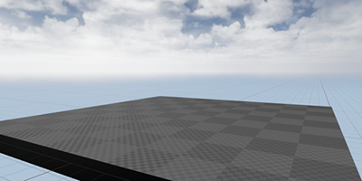
* `GameProjectDialog.BasicCodeThumbnail` 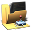
* `GameProjectDialog.CodeIcon` 
* `GameProjectDialog.CodeImage` 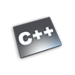
* `GameProjectDialog.CodeImage_64` 
* `GameProjectDialog.CodeImage_48x` 
* `GameProjectDialog.BlueprintIcon` 
* `GameProjectDialog.BlueprintImage` 
* `GameProjectDialog.BlueprintImage_64` 
* `GameProjectDialog.FolderIconClosed` 
* `GameProjectDialog.FolderIconOpen` 
* `GameProjectDialog.ProjectFileIcon` 
* `GameProjectDialog.IncludeStarterContent` 
* `GameProjectDialog.NoStarterContent` 
* `GameProjectDialog.XRDisabled` 
* `GameProjectDialog.XREnabled` 
* `GameProjectDialog.RaytracingDisabled` 
* `GameProjectDialog.RaytracingEnabled` 
* `NewClassDialog.ErrorLabelCloseButton` 
* `HardwareTargeting.MobilePlatform` 
* `HardwareTargeting.DesktopPlatform` 
* `HardwareTargeting.HardwareUnspecified` 
* `HardwareTargeting.MaximumQuality` 
* `HardwareTargeting.ScalableQuality` 
* `HardwareTargeting.GraphicsUnspecified` 
* `MultiBox.VisibleIcon16x` 
* `MultiBox.VisibleHighlightIcon16x` 
* `MultiBox.NotVisibleIcon16x` 
* `MultiBox.NotVisibleHighlightIcon16x` 
* `ToolBar.Icon` 
* `ToolBar.Expand` 
* `ToolBar.SubMenuIndicator` 
* `ViewportLayoutToolbar.Expand` 
* `HighresScreenshot.WarningStrip` 
* `HighresScreenshot.SpecifyCaptureRectangle` 
* `HighresScreenshot.FullViewportCaptureRegion` 
* `HighresScreenshot.CameraSafeAreaCaptureRegion` 
* `HighresScreenshot.Capture` 
* `HighresScreenshot.AcceptCaptureRegion` 
* `HighresScreenshot.DiscardCaptureRegion` 
* `TimecodeProvider.TabIcon` 
* `Level.VisibleIcon16x` 
* `Level.VisibleHighlightIcon16x` 
* `Level.NotVisibleIcon16x` 
* `Level.NotVisibleHighlightIcon16x` 
* `Level.LightingScenarioIcon16x` 
* `Level.LightingScenarioNotIcon16x` 
* `Level.LockedIcon16x` 
* `Level.LockedHighlightIcon16x` 
* `Level.UnlockedIcon16x` 
* `Level.UnlockedHighlightIcon16x` 
* `Level.ReadOnlyLockedIcon16x` 
* `Level.ReadOnlyLockedHighlightIcon16x` 
* `Level.SaveIcon16x` 
* `Level.SaveHighlightIcon16x` 
* `Level.SaveModifiedIcon16x` 
* `Level.SaveModifiedHighlightIcon16x` 
* `Level.SaveDisabledIcon16x` 
* `Level.SaveDisabledHighlightIcon16x` 
* `Level.ScriptIcon16x` 
* `Level.ScriptHighlightIcon16x` 
* `Level.EmptyIcon16x` 
* `Level.ColorIcon40x` 
* `WorldBrowser.AddLayer` 
* `WorldBrowser.SimulationViewPositon` 
* `WorldBrowser.MouseLocation` 
* `WorldBrowser.MarqueeRectSize` 
* `WorldBrowser.WorldSize` 
* `WorldBrowser.WorldOrigin` 
* `WorldBrowser.DirectionXPositive` 
* `WorldBrowser.DirectionXNegative` 
* `WorldBrowser.DirectionYPositive` 
* `WorldBrowser.DirectionYNegative` 
* `WorldBrowser.LevelStreamingBlueprint` 
* `WorldBrowser.LevelsMenuBrush` 
* `WorldBrowser.HierarchyButtonBrush` 
* `WorldBrowser.DetailsButtonBrush` 
* `WorldBrowser.CompositionButtonBrush` 
* `WorldBrowser.FolderClosed` 
* `WorldBrowser.FolderOpen` 
* `WorldBrowser.NewFolderIcon` 
* `Sequencer.IconKeyAuto` 
* `Sequencer.IconKeyBreak` 
* `Sequencer.IconKeyConstant` 
* `Sequencer.IconKeyLinear` 
* `Sequencer.IconKeyUser` 
* `Sequencer.KeyCircle` 
* `Sequencer.KeyDiamond` 
* `Sequencer.KeyDiamondBorder` 
* `Sequencer.KeySquare` 
* `Sequencer.KeyTriangle` 
* `Sequencer.KeyLeft` 
* `Sequencer.KeyRight` 
* `Sequencer.PartialKey` 
* `Sequencer.Star` 
* `Sequencer.Empty` 
* `Sequencer.TangentHandle` 
* `Sequencer.GenericDivider` 
* `Sequencer.Timeline.NotifyAlignmentMarker` 
* `Sequencer.Timeline.EaseInOut` 
* `Sequencer.NotificationImage_AddedPlayMovieSceneEvent` 
* `Sequencer.Save` 
* `Sequencer.Save.Small` 
* `Sequencer.SaveAsterisk` 
* `Sequencer.SaveAsterisk.Small` 
* `Sequencer.SaveAs` 
* `Sequencer.SaveAs.Small` 
* `Sequencer.DiscardChanges` 
* `Sequencer.DiscardChanges.Small` 
* `Sequencer.RestoreAnimatedState` 
* `Sequencer.RestoreAnimatedState.Small` 
* `Sequencer.Section.EasingHandle` 
* `Sequencer.ShotFilter` 
* `Sequencer.KeyMark` 
* `Sequencer.ToggleAutoKeyEnabled` 
* `Sequencer.ToggleAutoKeyEnabled.Small` 
* `Sequencer.SetAutoKey` 
* `Sequencer.SetAutoKey.Small` 
* `Sequencer.SetAutoTrack` 
* `Sequencer.SetAutoTrack.Small` 
* `Sequencer.SetAutoChangeAll` 
* `Sequencer.SetAutoChangeAll.Small` 
* `Sequencer.SetAutoChangeNone` 
* `Sequencer.SetAutoChangeNone.Small` 
* `Sequencer.AllowAllEdits` 
* `Sequencer.AllowAllEdits.Small` 
* `Sequencer.AllowSequencerEditsOnly` 
* `Sequencer.AllowSequencerEditsOnly.Small` 
* `Sequencer.AllowLevelEditsOnly` 
* `Sequencer.AllowLevelEditsOnly.Small` 
* `Sequencer.SetKeyAll` 
* `Sequencer.SetKeyAll.Small` 
* `Sequencer.SetKeyGroup` 
* `Sequencer.SetKeyGroup.Small` 
* `Sequencer.SetKeyChanged` 
* `Sequencer.SetKeyChanged.Small` 
* `Sequencer.ToggleIsSnapEnabled` 
* `Sequencer.ToggleIsSnapEnabled.Small` 
* `Sequencer.ToggleShowCurveEditor` 
* `Sequencer.ToggleShowCurveEditor.Small` 
* `Sequencer.OpenDirectorBlueprint` 
* `Sequencer.OpenDirectorBlueprint.Small` 
* `Sequencer.ToggleAutoScroll` 
* `Sequencer.ToggleAutoScroll.Small` 
* `Sequencer.MoveTool.Small` 
* `Sequencer.MarqueeTool.Small` 
* `Sequencer.RenderMovie.Small` 
* `Sequencer.CreateCamera.Small` 
* `Sequencer.FindInContentBrowser.Small` 
* `Sequencer.LockCamera` 
* `Sequencer.UnlockCamera` 
* `Sequencer.Thumbnail.SectionHandle` 
* `Sequencer.LockSequence` 
* `Sequencer.UnlockSequence` 
* `Sequencer.GeneralOptions` 
* `Sequencer.GeneralOptions.Small` 
* `Sequencer.PlaybackOptions` 
* `Sequencer.PlaybackOptions.Small` 
* `Sequencer.SelectEditOptions` 
* `Sequencer.SelectEditOptions.Small` 
* `Sequencer.Time` 
* `Sequencer.Time.Small` 
* `Sequencer.Value` 
* `Sequencer.Value.Small` 
* `Sequencer.Tracks.Media` 
* `Sequencer.Tracks.Audio` 
* `Sequencer.Tracks.Event` 
* `Sequencer.Tracks.Fade` 
* `Sequencer.Tracks.CameraCut` 
* `Sequencer.Tracks.CinematicShot` 
* `Sequencer.Tracks.Slomo` 
* `Sequencer.Tracks.Sub` 
* `Sequencer.Tracks.LevelVisibility` 
* `Sequencer.CursorDecorator_MarqueeAdd` 
* `Sequencer.CursorDecorator_MarqueeSubtract` 
* `Sequencer.BreadcrumbIcon` 
* `Sequencer.RecordSelectedActors` 
* `Sequencer.CreateEventBinding` 
* `Sequencer.CreateQuickBinding` 
* `Sequencer.ClearEventBinding` 
* `Sequencer.MultipleEvents` 
* `Sequencer.UnboundEvent` 
* `EMovieSceneBlendType::Absolute` 
* `EMovieSceneBlendType::Relative` 
* `EMovieSceneBlendType::Additive` 
* `SequenceRecorder.TabIcon` 
* `SequenceRecorder.Common.RecordAll.Small` 
* `SequenceRecorder.Common.RecordAll` 
* `SequenceRecorder.Common.StopAll.Small` 
* `SequenceRecorder.Common.StopAll` 
* `SequenceRecorder.Common.AddRecording.Small` 
* `SequenceRecorder.Common.AddRecording` 
* `SequenceRecorder.Common.AddCurrentPlayerRecording.Small` 
* `SequenceRecorder.Common.AddCurrentPlayerRecording` 
* `SequenceRecorder.Common.RemoveRecording.Small` 
* `SequenceRecorder.Common.RemoveRecording` 
* `SequenceRecorder.Common.RemoveAllRecordings.Small` 
* `SequenceRecorder.Common.RemoveAllRecordings` 
* `SequenceRecorder.Common.RecordingActive` 
* `SequenceRecorder.Common.RecordingInactive` 
* `ViewportMenu.Icon` 
* `ViewportMenu.Expand` 
* `ViewportMenu.SubMenuIndicator` 
* `ViewportActorPreview.Pinned` 
* `ViewportActorPreview.Unpinned` 
* `VRViewportActorPreview.Pinned` 
* `VRViewportActorPreview.Unpinned` 
* `VRViewportActorPreview.Attached` 
* `VRViewportActorPreview.Detached` 
* `NotificationBar.Expand` 
* `NotificationBar.SubMenuIndicator` 
* `Menu.Icon` 
* `Menu.Expand` 
* `Menu.SubMenuIndicator` 
* `Plus` 
* `Cross` 
* `ArrowUp` 
* `ArrowDown` 
* `Window.Background` 
* `Window.Title.Active` 
* `Window.Title.Inactive` 
* `Window.Buttons.Minimize.Normal` 
* `Window.Buttons.Minimize.Hovered` 
* `Window.Buttons.Minimize.Pressed` 
* `Window.Buttons.Minimize.Disabled` 
* `Window.Buttons.Maximize.Normal` 
* `Window.Buttons.Maximize.Hovered` 
* `Window.Buttons.Maximize.Pressed` 
* `Window.Buttons.Maximize.Disabled` 
* `Window.Buttons.Restore.Normal` 
* `Window.Buttons.Restore.Hovered` 
* `Window.Buttons.Restore.Pressed` 
* `Window.Buttons.Close.Normal` 
* `Window.Buttons.Close.Hovered` 
* `Window.Buttons.Close.Pressed` 
* `ChildWindow.Background` 
* `Docking.Tab.TabWellBrush` 
* `Docking.MajorTab.TabWellBrush` 
* `Docking.DefaultTabIcon` 
* `Docking.TabConextButton.Normal` 
* `Docking.TabConextButton.Pressed` 
* `Docking.TabConextButton.Hovered` 
* `Tutorials.Browser.CategoryArrow` 
* `Tutorials.Browser.DefaultTutorialIcon` 
* `Tutorials.Browser.DefaultCategoryIcon` 
* `Tutorials.Browser.BackButton.Image` 
* `Tutorials.Browser.PlayButton.Image` 
* `Tutorials.Browser.RestartButton` 
* `Tutorials.Browser.Completed` 
* `Tutorials.Browser.Breadcrumb` 
* `Tutorials.Navigation.NextButton` 
* `Tutorials.Navigation.HomeButton` 
* `Tutorials.Navigation.BackButton` 
* `Tutorials.CurrentExcerpt` 
* `Tutorials.Home` 
* `Tutorials.Back` 
* `Tutorials.Next` 
* `Tutorials.Content.ExternalLink` 
* `TutorialEditableText.Toolbar.HyperlinkImage` 
* `TutorialEditableText.Toolbar.ImageImage` 
* `TutorialLaunch.Circle` 
* `PropertyEditor.Grid.TabIcon` 
* `PropertyEditor.Properties.TabIcon` 
* `PropertyEditor.RemoveColumn` 
* `PropertyEditor.AddColumn` 
* `PropertyWindow.FilterSearch` 
* `PropertyWindow.FilterCancel` 
* `PropertyWindow.Favorites_Enabled` 
* `PropertyWindow.Favorites_Disabled` 
* `PropertyWindow.Locked` 
* `PropertyWindow.Unlocked` 
* `PropertyWindow.DiffersFromDefault` 
* `PropertyWindow.Button_Browse` 
* `PropertyWindow.Button_CreateNewBlueprint` 
* `PropertyWindow.Button_Use` 
* `PropertyWindow.Button_Delete` 
* `PropertyWindow.Button_Clear` 
* `PropertyWindow.Button_Edit` 
* `PropertyWindow.Button_EmptyArray` 
* `PropertyWindow.Button_AddToArray` 
* `PropertyWindow.Button_RemoveFromArray` 
* `PropertyWindow.Button_Ellipsis` 
* `PropertyWindow.Button_PickAsset` 
* `PropertyWindow.Button_PickActor` 
* `PropertyWindow.Button_PickActorInteractive` 
* `PropertyWindow.Button_Refresh` 
* `DetailsView.PulldownArrow.Down` 
* `DetailsView.PulldownArrow.Down.Hovered` 
* `DetailsView.PulldownArrow.Up` 
* `DetailsView.PulldownArrow.Up.Hovered` 
* `DetailsView.EditRawProperties` 
* `DetailsView.EditConfigProperties` 
* `DetailsView.CategoryMiddle` 
* `DetailsView.CategoryMiddle_Hovered` 
* `DetailsView.PropertyIsFavorite` 
* `DetailsView.PropertyIsNotFavorite` 
* `DetailsView.NoFavoritesSystem` 
* `DetailsView.AdvancedDropdownBorder.Open` 
* `Profiler.Tab` 
* `Profiler.Tab.GraphView` 
* `Profiler.Tab.EventGraph` 
* `Profiler.Tab.FiltersAndPresets` 
* `ProfilerCommand.ProfilerManager_Load` 
* `ProfilerCommand.ProfilerManager_Load.Small` 
* `ProfilerCommand.ProfilerManager_LoadMultiple` 
* `ProfilerCommand.ProfilerManager_LoadMultiple.Small` 
* `ProfilerCommand.ProfilerManager_Save` 
* `ProfilerCommand.ProfilerManager_Save.Small` 
* `ProfilerCommand.ProfilerManager_ToggleLivePreview` 
* `ProfilerCommand.ProfilerManager_ToggleLivePreview.Small` 
* `ProfilerCommand.StatsProfiler` 
* `ProfilerCommand.StatsProfiler.Small` 
* `ProfilerCommand.MemoryProfiler` 
* `ProfilerCommand.MemoryProfiler.Small` 
* `ProfilerCommand.FPSChart` 
* `ProfilerCommand.FPSChart.Small` 
* `ProfilerCommand.OpenSettings` 
* `ProfilerCommand.OpenSettings.Small` 
* `ProfilerCommand.ToggleDataPreview` 
* `ProfilerCommand.ToggleDataPreview.Small` 
* `ProfilerCommand.ToggleDataCapture` 
* `ProfilerCommand.ToggleDataCapture.Small` 
* `ProfilerCommand.ToggleDataCapture.Checked` 
* `ProfilerCommand.ToggleDataCapture.Checked.Small` 
* `ProfilerCommand.ToggleShowDataGraph` 
* `ProfilerCommand.OpenEventGraph` 
* `Profiler.LineGraphArea` 
* `Profiler.Tooltip.HintIcon10` 
* `Profiler.EventGraph.SetRoot` 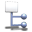
* `Profiler.EventGraph.CullEvents` 
* `Profiler.EventGraph.FilterEvents` 
* `Profiler.EventGraph.SelectStack` 
* `Profiler.EventGraph.ExpandAll` 
* `Profiler.EventGraph.CollapseAll` 
* `Profiler.EventGraph.ExpandSelection` 
* `Profiler.EventGraph.CollapseSelection` 
* `Profiler.EventGraph.ExpandThread` 
* `Profiler.EventGraph.CollapseThread` 
* `Profiler.EventGraph.ExpandHotPath` 
* `Profiler.EventGraph.HotPathSmall` 
* `Profiler.EventGraph.ExpandHotPath16` 
* `Profiler.EventGraph.GameThread` 
* `Profiler.EventGraph.RenderThread` 
* `Profiler.EventGraph.ViewColumn` 
* `Profiler.EventGraph.ResetColumn` 
* `Profiler.EventGraph.HistoryBack` 
* `Profiler.EventGraph.HistoryForward` 
* `Profiler.EventGraph.MaximumIcon` 
* `Profiler.EventGraph.AverageIcon` 
* `Profiler.EventGraph.FlatIcon` 
* `Profiler.EventGraph.FlatCoalescedIcon` 
* `Profiler.EventGraph.HierarchicalIcon` 
* `Profiler.EventGraph.HasCulledEventsSmall` 
* `Profiler.EventGraph.CulledEvent` 
* `Profiler.EventGraph.FilteredEvent` 
* `Profiler.Misc.WarningSmall` 
* `Profiler.Misc.SortBy` 
* `Profiler.Misc.SortAscending` 
* `Profiler.Misc.SortDescending` 
* `Profiler.Misc.ResetToDefault` 
* `Profiler.Misc.Save16` 
* `Profiler.Misc.Reset16` 
* `Profiler.Type.Calls` 
* `Profiler.Type.Event` 
* `Profiler.Type.Memory` 
* `Profiler.Type.Number` 
* `Profiler.Type.NumberInt` 
* `Profiler.Type.NumberFloat` 
* `Profiler.Type.Memory` 
* `Profiler.Type.Hierarchical` 
* `Profiler.Misc.GenericFilter` 
* `Profiler.Misc.GenericGroup` 
* `Profiler.Misc.CopyToClipboard` 
* `Profiler.Misc.Disconnect` 
* `Profiler.Type.Calls` 
* `Profiler.Type.Calls.Small` 
* `Graph.Arrow` 
* `Graph.ExecutionBubble` 
* `Graph.Panel.SolidBackground` 
* `Graph.Node.Separator` 
* `Graph.Node.DisabledBanner` 
* `Graph.Node.DevelopmentBanner` 
* `Graph.Node.IndicatorOverlay` 
* `Graph.Node.RerouteShadow` 
* `Graph.Node.RerouteShadowSelected` 
* `Graph.Node.CommentArrow` 
* `Graph.VarNode.ColorSpill` 
* `Graph.VarNode.IndicatorOverlay` 
* `Graph.StateNode.Icon` 
* `Graph.ConduitNode.Icon` 
* `Graph.TransitionNode.Icon` 
* `Graph.TransitionNode.Icon_Inertialization` 
* `BTEditor.Graph.BTNode.Icon` 
* `BTEditor.Graph.BTNode.Root.Icon` 
* `BTEditor.Graph.BTNode.Composite.Selector.Icon` 
* `BTEditor.Graph.BTNode.Composite.Sequence.Icon` 
* `BTEditor.Graph.BTNode.Composite.SimpleParallel.Icon` 
* `BTEditor.Graph.BTNode.Decorator.Blackboard.Icon` 
* `BTEditor.Graph.BTNode.Decorator.CompareBlackboardEntries.Icon` 
* `BTEditor.Graph.BTNode.Decorator.Conditional.Icon` 
* `BTEditor.Graph.BTNode.Decorator.ConeCheck.Icon` 
* `BTEditor.Graph.BTNode.Decorator.Cooldown.Icon` 
* `BTEditor.Graph.BTNode.Decorator.DoesPathExist.Icon` 
* `BTEditor.Graph.BTNode.Decorator.ForceSuccess.Icon` 
* `BTEditor.Graph.BTNode.Decorator.KeepInCone.Icon` 
* `BTEditor.Graph.BTNode.Decorator.Loop.Icon` 
* `BTEditor.Graph.BTNode.Decorator.NonConditional.Icon` 
* `BTEditor.Graph.BTNode.Decorator.Optional.Icon` 
* `BTEditor.Graph.BTNode.Decorator.ReachedMoveGoal.Icon` 
* `BTEditor.Graph.BTNode.Decorator.TimeLimit.Icon` 
* `BTEditor.Graph.BTNode.Service.Icon` 
* `BTEditor.Graph.BTNode.Service.DefaultFocus.Icon` 
* `BTEditor.Graph.BTNode.Task.Icon` 
* `BTEditor.Graph.BTNode.Task.MakeNoise.Icon` 
* `BTEditor.Graph.BTNode.Task.MoveDirectlyToward.Icon` 
* `BTEditor.Graph.BTNode.Task.MoveTo.Icon` 
* `BTEditor.Graph.BTNode.Task.PlaySound.Icon` 
* `BTEditor.Graph.BTNode.Task.RunBehavior.Icon` 
* `BTEditor.Graph.BTNode.Task.RunEQSQuery.Icon` 
* `BTEditor.Graph.BTNode.Task.Wait.Icon` 
* `BTEditor.Graph.BTNode.Blueprint` 
* `BTEditor.Debugger.BackOver` 
* `BTEditor.Debugger.BackOver.Small` 
* `BTEditor.Debugger.BackInto` 
* `BTEditor.Debugger.BackInto.Small` 
* `BTEditor.Debugger.ForwardInto` 
* `BTEditor.Debugger.ForwardInto.Small` 
* `BTEditor.Debugger.ForwardOver` 
* `BTEditor.Debugger.ForwardOver.Small` 
* `BTEditor.Debugger.StepOut` 
* `BTEditor.Debugger.StepOut.Small` 
* `BTEditor.Debugger.SingleStep` 
* `BTEditor.Debugger.SingleStep.Small` 
* `BTEditor.Debugger.PausePlaySession` 
* `BTEditor.Debugger.PausePlaySession.Small` 
* `BTEditor.Debugger.ResumePlaySession` 
* `BTEditor.Debugger.ResumePlaySession.Small` 
* `BTEditor.Debugger.StopPlaySession` 
* `BTEditor.Debugger.StopPlaySession.Small` 
* `BTEditor.Debugger.LateJoinSession` 
* `BTEditor.Debugger.LateJoinSession.Small` 
* `BTEditor.Debugger.CurrentValues` 
* `BTEditor.Debugger.CurrentValues.Small` 
* `BTEditor.Debugger.SavedValues` 
* `BTEditor.Debugger.SavedValues.Small` 
* `BTEditor.DebuggerOverlay.Breakpoint.Disabled` 
* `BTEditor.DebuggerOverlay.Breakpoint.Enabled` 
* `BTEditor.DebuggerOverlay.ActiveNodePointer` 
* `BTEditor.DebuggerOverlay.SearchTriggerPointer` 
* `BTEditor.DebuggerOverlay.FailedTriggerPointer` 
* `BTEditor.DebuggerOverlay.BreakOnBreakpointPointer` 
* `BTEditor.Blackboard.NewEntry` 
* `BTEditor.Blackboard.NewEntry.Small` 
* `BTEditor.SwitchToBehaviorTreeMode` 
* `BTEditor.SwitchToBehaviorTreeMode.Small` 
* `BTEditor.SwitchToBlackboardMode` 
* `BTEditor.SwitchToBlackboardMode.Small` 
* `ClassIcon.BlackboardKeyType_Bool` 
* `ClassIcon.BlackboardKeyType_Class` 
* `ClassIcon.BlackboardKeyType_Enum` 
* `ClassIcon.BlackboardKeyType_Float` 
* `ClassIcon.BlackboardKeyType_Int` 
* `ClassIcon.BlackboardKeyType_Name` 
* `ClassIcon.BlackboardKeyType_NativeEnum` 
* `ClassIcon.BlackboardKeyType_Object` 
* `ClassIcon.BlackboardKeyType_Rotator` 
* `ClassIcon.BlackboardKeyType_String` 
* `ClassIcon.BlackboardKeyType_Vector` 
* `BTEditor.Common.NewBlackboard` 
* `BTEditor.Common.NewBlackboard.Small` 
* `BTEditor.Graph.NewTask` 
* `BTEditor.Graph.NewTask.Small` 
* `BTEditor.Graph.NewDecorator` 
* `BTEditor.Graph.NewDecorator.Small` 
* `BTEditor.Graph.NewService` 
* `BTEditor.Graph.NewService.Small` 
* `EnvQueryEditor.Profiler.LoadStats` 
* `EnvQueryEditor.Profiler.SaveStats` 
* `TransitionNodeButton.Hovered` 
* `TransitionNodeButton.Pressed` 
* `Graph.AnimationResultNode.Body` 
* `Graph.AnimationFastPathIndicator` 
* `Graph.SoundResultNode.Body` 
* `Graph.Node.NodeEntryTop` 
* `Graph.Node.NodeEntryBottom` 
* `Graph.Node.NodeExitTop` 
* `Graph.Node.NodeExitBottom` 
* `Graph.Node.Autoplay` 
* `Graph.Node.Loop` 
* `Graph.Pin.DefaultPinSeparator` 
* `Graph.Pin.Connected` 
* `Graph.Pin.Disconnected` 
* `Graph.ArrayPin.Connected` 
* `Graph.ArrayPin.Disconnected` 
* `Graph.RefPin.Connected` 
* `Graph.RefPin.Disconnected` 
* `Graph.Pin.CopyNodePinLeft_Connected` 
* `Graph.Pin.CopyNodePinLeft_Disconnected` 
* `Graph.Pin.CopyNodePinRight_Connected` 
* `Graph.Pin.CopyNodePinRight_Disconnected` 
* `Graph.Pin.Connected_VarA` 
* `Graph.Pin.Disconnected_VarA` 
* `Graph.DelegatePin.Connected` 
* `Graph.DelegatePin.Disconnected` 
* `Graph.Replication.AuthorityOnly` 
* `Graph.Replication.ClientEvent` 
* `Graph.Replication.Replicated` 
* `Graph.Editor.EditorOnlyIcon` 
* `Graph.Event.InterfaceEventIcon` 
* `Graph.Latent.LatentIcon` 
* `Graph.Message.MessageIcon` 
* `Graph.ExecPin.Connected` 
* `Graph.ExecPin.Disconnected` 
* `Graph.ExecPin.ConnectedHovered` 
* `Graph.ExecPin.DisconnectedHovered` 
* `Graph.PosePin.Connected` 
* `Graph.PosePin.Disconnected` 
* `Graph.PosePin.ConnectedHovered` 
* `Graph.PosePin.DisconnectedHovered` 
* `Graph.ExecEventPin.Connected` 
* `Graph.ExecEventPin.Disconnected` 
* `Graph.ExecEventPin.ConnectedHovered` 
* `Graph.ExecEventPin.DisconnectedHovered` 
* `Graph.WatchedPinIcon_Pinned` 
* `Graph.Pin.BackgroundHovered` 
* `Graph.Pin.ObjectSet` 
* `Graph.Pin.ObjectEmpty` 
* `Graph.ConnectorFeedback.OK` 
* `Graph.ConnectorFeedback.OKWarn` 
* `Graph.ConnectorFeedback.Error` 
* `Graph.ConnectorFeedback.NewNode` 
* `Graph.ConnectorFeedback.ViaCast` 
* `Graph.ConnectorFeedback.ShowNode` 
* `GraphEditor.Default_16x` 
* `GraphEditor.EventGraph_16x` 
* `GraphEditor.InterfaceFunction_16x` 
* `GraphEditor.Macro_16x` 
* `GraphEditor.Function_16x` 
* `GraphEditor.PureFunction_16x` 
* `GraphEditor.PotentialOverrideFunction_16x` 
* `GraphEditor.OverrideFunction_16x` 
* `GraphEditor.OverridePureFunction_16x` 
* `GraphEditor.SubGraph_16x` 
* `GraphEditor.Animation_16x` 
* `GraphEditor.Conduit_16x` 
* `GraphEditor.Rule_16x` 
* `GraphEditor.State_16x` 
* `GraphEditor.StateMachine_16x` 
* `GraphEditor.Event_16x` 
* `GraphEditor.CustomEvent_16x` 
* `GraphEditor.CallInEditorEvent_16x` 
* `GraphEditor.Timeline_16x` 
* `GraphEditor.Comment_16x` 
* `GraphEditor.Documentation_16x` 
* `GraphEditor.Switch_16x` 
* `GraphEditor.BreakStruct_16x` 
* `GraphEditor.MakeStruct_16x` 
* `GraphEditor.Sequence_16x` 
* `GraphEditor.Branch_16x` 
* `GraphEditor.SpawnActor_16x` 
* `GraphEditor.PadEvent_16x` 
* `GraphEditor.MouseEvent_16x` 
* `GraphEditor.KeyEvent_16x` 
* `GraphEditor.TouchEvent_16x` 
* `GraphEditor.MakeArray_16x` 
* `GraphEditor.MakeSet_16x` 
* `GraphEditor.MakeMap_16x` 
* `GraphEditor.Enum_16x` 
* `GraphEditor.Select_16x` 
* `GraphEditor.Cast_16x` 
* `GraphEditor.Macro.Loop_16x` 
* `GraphEditor.Macro.Gate_16x` 
* `GraphEditor.Macro.DoN_16x` 
* `GraphEditor.Macro.DoOnce_16x` 
* `GraphEditor.Macro.IsValid_16x` 
* `GraphEditor.Macro.FlipFlop_16x` 
* `GraphEditor.Macro.ForEach_16x` 
* `GraphEditor.Delegate_16x` 
* `GraphEditor.Delegate_24x` 
* `GraphEditor.EventGraph_24x` 
* `GraphEditor.InterfaceFunction_24x` 
* `GraphEditor.Macro_24x` 
* `GraphEditor.Function_24x` 
* `GraphEditor.PotentialOverrideFunction_24x` 
* `GraphEditor.OverrideFunction_24x` 
* `GraphEditor.SubGraph_24x` 
* `GraphEditor.Animation_24x` 
* `GraphEditor.Conduit_24x` 
* `GraphEditor.Rule_24x` 
* `GraphEditor.State_24x` 
* `GraphEditor.StateMachine_24x` 
* `GraphEditor.FunctionGlyph` 
* `GraphEditor.NodeGlyph` 
* `GraphEditor.PinIcon` 
* `GraphEditor.ArrayPinIcon` 
* `GraphEditor.RefPinIcon` 
* `GraphEditor.UbergraphGlyph` 
* `GraphEditor.SubgraphGlyph` 
* `GraphEditor.AnimationGlyph` 
* `GraphEditor.MacroGlyph` 
* `GraphEditor.EnumGlyph` 
* `GraphEditor.TimelineGlyph` 
* `GraphEditor.EventGlyph` 
* `GraphEditor.EventCustomGlyph` 
* `GraphEditor.SCSGlyph` 
* `GraphEditor.StructGlyph` 
* `GraphEditor.FIB_CallFunction` 
* `GraphEditor.FIB_MacroInstance` 
* `GraphEditor.FIB_Event` 
* `GraphEditor.FIB_VariableGet` 
* `GraphEditor.FIB_VariableSet` 
* `GraphEditor.FunctionOL.Interface` 
* `GraphEditor.FunctionOL.New` 
* `GraphEditor.FunctionOL.Override` 
* `GraphEditor.FunctionOL.PotentialOverride` 
* `GraphEditor.GetSequenceBinding` 
* `GraphEditor.HideUnusedPins` 
* `GraphEditor.HideUnusedPins.Small` 
* `GraphEditor.GoToDocumentation` 
* `GraphEditor.AlignNodesTop` 
* `GraphEditor.AlignNodesMiddle` 
* `GraphEditor.AlignNodesBottom` 
* `GraphEditor.AlignNodesLeft` 
* `GraphEditor.AlignNodesCenter` 
* `GraphEditor.AlignNodesRight` 
* `GraphEditor.StraightenConnections` 
* `GraphEditor.DistributeNodesHorizontally` 
* `GraphEditor.DistributeNodesVertically` 
* `GraphEditor.ToggleHideUnrelatedNodes` 
* `GraphEditor.ToggleHideUnrelatedNodes.Small` 
* `TimelineEditor.AddFloatTrack` 
* `TimelineEditor.AddVectorTrack` 
* `TimelineEditor.AddEventTrack` 
* `TimelineEditor.AddColorTrack` 
* `TimelineEditor.AddCurveAssetTrack` 
* `TimelineEditor.DeleteTrack` 
* `SCSEditor.ToggleComponentEditing` 
* `SCSEditor.ToggleComponentEditing.Small` 
* `SCSEditor.PromoteToBlueprintIcon` 
* `LevelEditor.BrowseDocumentation` 
* `LevelEditor.BrowseAPIReference` 
* `LevelEditor.Tutorials` 
* `LevelEditor.BrowseViewportControls` 
* `MainFrame.VisitAskAQuestionPage` 
* `MainFrame.VisitWiki` 
* `MainFrame.VisitForums` 
* `MainFrame.VisitSearchForAnswersPage` 
* `MainFrame.VisitSupportWebSite` 
* `MainFrame.VisitEpicGamesDotCom` 
* `MainFrame.AboutUnrealEd` 
* `MainFrame.CreditsUnrealEd` 
* `EditorViewport.TranslateMode` 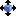
* `EditorViewport.TranslateMode.Small` 
* `EditorViewport.RotateMode` 
* `EditorViewport.RotateMode.Small` 
* `EditorViewport.ScaleMode` 
* `EditorViewport.ScaleMode.Small` 
* `EditorViewport.TranslateRotateMode` 
* `EditorViewport.TranslateRotateMode.Small` 
* `EditorViewport.TranslateRotate2DMode` 
* `EditorViewport.TranslateRotate2DMode.Small` 
* `EditorViewport.ToggleRealTime` 
* `EditorViewport.ToggleRealTime.Small` 
* `EditorViewport.LocationGridSnap` 
* `EditorViewport.RotationGridSnap` 
* `EditorViewport.Layer2DSnap` 
* `EditorViewport.ScaleGridSnap` 
* `EditorViewport.ToggleSurfaceSnapping` 
* `EditorViewport.RelativeCoordinateSystem_Local` 
* `EditorViewport.RelativeCoordinateSystem_Local.Small` 
* `EditorViewport.RelativeCoordinateSystem_World` 
* `EditorViewport.RelativeCoordinateSystem_World.Small` 
* `EditorViewport.CamSpeedSetting` 
* `EditorViewport.LitMode` 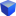
* `EditorViewport.UnlitMode` 
* `EditorViewport.WireframeMode` 
* `EditorViewport.DetailLightingMode` 
* `EditorViewport.LightingOnlyMode` 
* `EditorViewport.LightComplexityMode` 
* `EditorViewport.ShaderComplexityMode` 
* `EditorViewport.QuadOverdrawMode` 
* `EditorViewport.ShaderComplexityWithQuadOverdrawMode` 
* `EditorViewport.TexStreamAccPrimitiveDistanceMode` 
* `EditorViewport.TexStreamAccMeshUVDensityMode` 
* `EditorViewport.TexStreamAccMaterialTextureScaleMode` 
* `EditorViewport.RequiredTextureResolutionMode` 
* `EditorViewport.StationaryLightOverlapMode` 
* `EditorViewport.LightmapDensityMode` 
* `EditorViewport.LODColorationMode` 
* `EditorViewport.HLODColorationMode` 
* `EditorViewport.GroupLODColorationMode` 
* `EditorViewport.VisualizeGBufferMode` 
* `EditorViewport.ReflectionOverrideMode` 
* `EditorViewport.VisualizeBufferMode` 
* `EditorViewport.CollisionPawn` 
* `EditorViewport.CollisionVisibility` 
* `EditorViewport.Perspective` 
* `EditorViewport.Top` 
* `EditorViewport.Left` 
* `EditorViewport.Front` 
* `EditorViewport.Bottom` 
* `EditorViewport.Right` 
* `EditorViewport.Back` 
* `LevelEditor.Tabs.Details` 
* `LevelEditor.Tabs.Cinematics` 
* `LevelEditor.Tabs.EditorModes` 
* `LevelEditor.Tabs.Modes` 
* `LevelEditor.Tabs.Properties` 
* `LevelEditor.Tabs.Outliner` 
* `LevelEditor.Tabs.ContentBrowser` 
* `LevelEditor.Tabs.Levels` 
* `LevelEditor.Tabs.WorldBrowser` 
* `LevelEditor.Tabs.WorldBrowserDetails` 
* `LevelEditor.Tabs.WorldBrowserComposition` 
* `LevelEditor.Tabs.Layers` 
* `LevelEditor.Tabs.BuildAndSubmit` 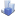
* `LevelEditor.Tabs.StatsViewer` 
* `LevelEditor.Tabs.Toolbar` 
* `LevelEditor.Tabs.Viewports` 
* `LevelEditor.Tabs.HLOD` 
* `LevelEditor.NewLevel` 
* `LevelEditor.OpenLevel` 
* `LevelEditor.Save` 
* `LevelEditor.SaveAs` 
* `LevelEditor.SaveAllLevels` 
* `LevelEditor.Build` 
* `LevelEditor.Build.Small` 
* `LevelEditor.MapCheck` 
* `LevelEditor.Recompile` 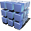
* `LevelEditor.Recompile.Small` 
* `LevelEditor.SourceControl` 
* `LevelEditor.SourceControl.Small` 
* `LevelEditor.SourceControl.On` 
* `LevelEditor.SourceControl.On.Small` 
* `LevelEditor.SourceControl.Off` 
* `LevelEditor.SourceControl.Off.Small` 
* `LevelEditor.SourceControl.Unknown` 
* `LevelEditor.SourceControl.Unknown.Small` 
* `LevelEditor.SourceControl.Problem` 
* `LevelEditor.SourceControl.Problem.Small` 
* `LevelEditor.PreviewMode.Enabled` 
* `LevelEditor.PreviewMode.Enabled.Small` 
* `LevelEditor.PreviewMode.Disabled` 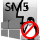
* `LevelEditor.PreviewMode.Disabled.Small` 
* `LevelEditor.PreviewMode.SM5.Enabled` 
* `LevelEditor.PreviewMode.SM5.Enabled.Small` 
* `LevelEditor.PreviewMode.SM5.Disabled` 
* `LevelEditor.PreviewMode.SM5.Disabled.Small` 
* `LevelEditor.PreviewMode.SM4.Enabled` 
* `LevelEditor.PreviewMode.SM4.Enabled.Small` 
* `LevelEditor.PreviewMode.SM4.Disabled` 
* `LevelEditor.PreviewMode.SM4.Disabled.Small` 
* `LevelEditor.PreviewMode.AndroidES2.Enabled` 
* `LevelEditor.PreviewMode.AndroidES2.Enabled.Small` 
* `LevelEditor.PreviewMode.AndroidES2.Disabled` 
* `LevelEditor.PreviewMode.AndroidES2.Disabled.Small` 
* `LevelEditor.PreviewMode.AndroidES31.Enabled` 
* `LevelEditor.PreviewMode.AndroidES31.Enabled.Small` 
* `LevelEditor.PreviewMode.AndroidES31.Disabled` 
* `LevelEditor.PreviewMode.AndroidES31.Disabled.Small` 
* `LevelEditor.PreviewMode.AndroidVulkan.Enabled` 
* `LevelEditor.PreviewMode.AndroidVulkan.Enabled.Small` 
* `LevelEditor.PreviewMode.AndroidVulkan.Disabled` 
* `LevelEditor.PreviewMode.AndroidVulkan.Disabled.Small` 
* `LevelEditor.PreviewMode.iOS.Enabled` 
* `LevelEditor.PreviewMode.iOS.Enabled.Small` 
* `LevelEditor.PreviewMode.iOS.Disabled` 
* `LevelEditor.PreviewMode.iOS.Disabled.Small` 
* `LevelEditor.ViewOptions` 
* `LevelEditor.ViewOptions.Small` 
* `LevelEditor.GameSettings` 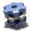
* `LevelEditor.GameSettings.Small` 
* `LevelEditor.Create` 
* `LevelEditor.Create.Small` 
* `LevelEditor.Create.OutlineHoriz` 
* `LevelEditor.Create.OutlineVert` 
* `LevelEditor.EditorModes` 
* `LevelEditor.EditorModes.Small` 
* `LevelEditor.EditorModes.Menu` 
* `LevelEditor.PlacementMode` 
* `LevelEditor.PlacementMode.Small` 
* `LevelEditor.PlacementMode.Selected` 
* `LevelEditor.PlacementMode.Selected.Small` 
* `LevelEditor.MeshPaintMode` 
* `LevelEditor.MeshPaintMode.Small` 
* `LevelEditor.MeshPaintMode.Selected` 
* `LevelEditor.MeshPaintMode.Selected.Small` 
* `LevelEditor.MeshPaintMode.TexturePaint` 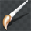
* `LevelEditor.MeshPaintMode.TexturePaint.Small` 
* `LevelEditor.MeshPaintMode.ColorPaint` 
* `LevelEditor.MeshPaintMode.ColorPaint.Small` 
* `LevelEditor.MeshPaintMode.WeightPaint` 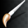
* `LevelEditor.MeshPaintMode.WeightPaint.Small` 
* `LevelEditor.LandscapeMode` 
* `LevelEditor.LandscapeMode.Small` 
* `LevelEditor.LandscapeMode.Selected` 
* `LevelEditor.LandscapeMode.Selected.Small` 
* `LevelEditor.FoliageMode` 
* `LevelEditor.FoliageMode.Small` 
* `LevelEditor.FoliageMode.Selected` 
* `LevelEditor.FoliageMode.Selected.Small` 
* `LevelEditor.BspMode` 
* `LevelEditor.BspMode.Small` 
* `LevelEditor.BspMode.Selected` 
* `LevelEditor.BspMode.Selected.Small` 
* `LevelEditor.WorldProperties` 
* `LevelEditor.WorldProperties.Small` 
* `LevelEditor.WorldProperties.Tab` 
* `LevelEditor.OpenContentBrowser` 
* `LevelEditor.OpenContentBrowser.Small` 
* `LevelEditor.OpenMarketplace` 
* `LevelEditor.OpenMarketplace.Small` 
* `LevelEditor.OpenMarketplace.Menu` 
* `LevelEditor.OpenLevelBlueprint` 
* `LevelEditor.OpenLevelBlueprint.Small` 
* `LevelEditor.CreateClassBlueprint` 
* `LevelEditor.OpenClassBlueprint` 
* `LevelEditor.EditMatinee` 
* `LevelEditor.EditMatinee.Small` 
* `LevelEditor.ToggleVR` 
* `LevelEditor.ToggleVR.Small` 
* `MergeActors.MeshMergingTool` 
* `MergeActors.MeshProxyTool` 
* `MergeActors.MeshInstancingTool` 
* `MergeActors.TabIcon` 
* `PlacementBrowser.OptionsMenu` 
* `PlacementBrowser.ActiveTabNub` 
* `PlacementBrowser.ActiveTabBar` 
* `PlacementBrowser.ShowAllContent` 
* `PlacementBrowser.ShowAllContent.Small` 
* `PlacementBrowser.ShowCollections` 
* `PlacementBrowser.ShowCollections.Small` 
* `ContentPalette.ShowAllPlaceables` 
* `ContentPalette.ShowAllPlaceables.Small` 
* `ContentPalette.ShowProps` 
* `ContentPalette.ShowProps.Small` 
* `ContentPalette.ShowParticles` 
* `ContentPalette.ShowParticles.Small` 
* `ContentPalette.ShowAudio` 
* `ContentPalette.ShowAudio.Small` 
* `ContentPalette.ShowMisc` 
* `ContentPalette.ShowMisc.Small` 
* `ContentPalette.ShowRecentlyPlaced` 
* `ContentPalette.ShowRecentlyPlaced.Small` 
* `AssetDeleteDialog.Background` 
* `LevelEditor.RecompileGameCode` 
* `LevelViewport.ViewportConfig_OnePane` 
* `LevelViewport.ViewportConfig_OnePane.Small` 
* `LevelViewport.ViewportConfig_TwoPanesH` 
* `LevelViewport.ViewportConfig_TwoPanesH.Small` 
* `LevelViewport.ViewportConfig_TwoPanesV` 
* `LevelViewport.ViewportConfig_TwoPanesV.Small` 
* `LevelViewport.ViewportConfig_ThreePanesLeft` 
* `LevelViewport.ViewportConfig_ThreePanesLeft.Small` 
* `LevelViewport.ViewportConfig_ThreePanesRight` 
* `LevelViewport.ViewportConfig_ThreePanesRight.Small` 
* `LevelViewport.ViewportConfig_ThreePanesTop` 
* `LevelViewport.ViewportConfig_ThreePanesTop.Small` 
* `LevelViewport.ViewportConfig_ThreePanesBottom` 
* `LevelViewport.ViewportConfig_ThreePanesBottom.Small` 
* `LevelViewport.ViewportConfig_FourPanesLeft` 
* `LevelViewport.ViewportConfig_FourPanesLeft.Small` 
* `LevelViewport.ViewportConfig_FourPanesRight` 
* `LevelViewport.ViewportConfig_FourPanesRight.Small` 
* `LevelViewport.ViewportConfig_FourPanesTop` 
* `LevelViewport.ViewportConfig_FourPanesTop.Small` 
* `LevelViewport.ViewportConfig_FourPanesBottom` 
* `LevelViewport.ViewportConfig_FourPanesBottom.Small` 
* `LevelViewport.ViewportConfig_FourPanes2x2` 
* `LevelViewport.ViewportConfig_FourPanes2x2.Small` 
* `LevelViewport.EjectActorPilot` 
* `LevelViewport.EjectActorPilot.Small` 
* `LevelViewport.PilotSelectedActor` 
* `LevelViewport.PilotSelectedActor.Small` 
* `LevelViewport.ToggleActorPilotCameraView` 
* `LevelViewport.ToggleActorPilotCameraView.Small` 
* `TransformSettings.RelativeCoordinateSettings` 
* `MeshProxy.SimplygonLogo` 
* `LevelViewport.ActorLockIcon` 
* `LevelViewport.Icon` 
* `LevelViewport.CursorIcon` 
* `LevelEditor.ShowAll` 
* `LevelEditor.ShowSelectedOnly` 
* `LevelEditor.ShowSelected` 
* `LevelEditor.HideSelected` 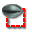
* `EditorViewportToolBar.MenuDropdown` 
* `LevelViewportToolBar.Maximize.Normal` 
* `LevelViewportToolBar.Maximize.Checked` 
* `LevelViewportToolBar.RestoreFromImmersive.Normal` 
* `ShowFlagsMenu.AntiAliasing` 
* `ShowFlagsMenu.Atmosphere` 
* `ShowFlagsMenu.BSP` 
* `ShowFlagsMenu.Collision` 
* `ShowFlagsMenu.Decals` 
* `ShowFlagsMenu.Fog` 
* `ShowFlagsMenu.Grid` 
* `ShowFlagsMenu.Landscape` 
* `ShowFlagsMenu.MediaPlanes` 
* `ShowFlagsMenu.Navigation` 
* `ShowFlagsMenu.Particles` 
* `ShowFlagsMenu.SkeletalMeshes` 
* `ShowFlagsMenu.StaticMeshes` 
* `ShowFlagsMenu.Translucency` 
* `ShowFlagsMenu.WidgetComponents` 
* `Mobility.Movable` 
* `Mobility.Stationary` 
* `Mobility.Static` 
* `PropertyEditor.ExperimentalClass` 
* `PropertyEditor.EarlyAccessClass` 
* `MeshPaint.Fill` 
* `MeshPaint.Fill.Small` 
* `MeshPaint.Propagate` 
* `MeshPaint.Propagate.Small` 
* `MeshPaint.Import` 
* `MeshPaint.Import.Small` 
* `MeshPaint.FindInCB` 
* `MeshPaint.Save` 
* `MeshPaint.Save.Small` 
* `MeshPaint.Fix` 
* `MeshPaint.Fix.Small` 
* `MeshPaint.Remove` 
* `MeshPaint.Remove.Small` 
* `MeshPaint.Copy` 
* `MeshPaint.Copy.Small` 
* `MeshPaint.Paste` 
* `MeshPaint.Paste.Small` 
* `MeshPaint.Swap` 
* `NewsFeed.ToolbarIcon.Small` 
* `NewsFeed.MarkAsRead` 
* `NewsFeed.PendingIcon` 
* `NewsFeed.ReloadButton` 
* `NewsFeed.SettingsButton` 
* `NewsFeed.UnreadCountBackground` 
* `EditorModesToolbar.Icon` 
* `EditorModesToolbar.Expand` 
* `EditorModesToolbar.SubMenuIndicator` 
* `MultiBox.GenericToolBarIcon` 
* `MultiBox.GenericToolBarIcon.Small` 
* `Scalability.ScalabilitySettings` 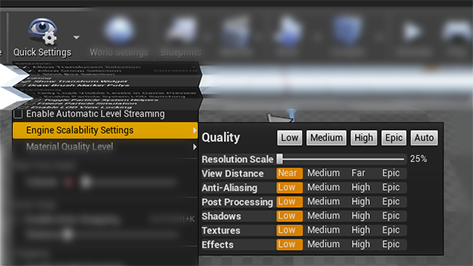
* `WorkspaceMenu.AdditionalUI` 
* `AnimViewportMenu.TranslateMode` 
* `AnimViewportMenu.TranslateMode.Small` 
* `AnimViewportMenu.RotateMode` 
* `AnimViewportMenu.RotateMode.Small` 
* `AnimViewportMenu.CameraFollow` 
* `AnimViewportMenu.CameraFollow.Small` 
* `AnimViewport.LocalSpaceEditing` 
* `AnimViewport.WorldSpaceEditing` 
* `AnimViewportMenu.PlayBackSpeed` 
* `AnimViewportMenu.TurnTableSpeed` 
* `AnimViewportMenu.SceneSetup` 
* `Persona.ConvertAnimationGraph` 
* `Persona.ReimportAsset` 
* `Persona.ConvertToStaticMesh` 
* `Persona.ConvertToStaticMesh.Small` 
* `Persona.BakeMaterials` 
* `Persona.BakeMaterials.Small` 
* `AnimSlotManager.SaveSkeleton` 
* `AnimSlotManager.SaveSkeleton.Small` 
* `AnimSlotManager.AddGroup` 
* `AnimSlotManager.AddGroup.Small` 
* `AnimSlotManager.AddSlot` 
* `AnimSlotManager.AddSlot.Small` 
* `AnimSlotManager.Warning` 
* `AnimNotifyEditor.BranchingPoint` 
* `SkeletonTree.SkeletonSocket` 
* `SkeletonTree.MeshSocket` 
* `FullBlueprintEditor.SwitchToScriptingMode` 
* `FullBlueprintEditor.SwitchToScriptingMode.Small` 
* `FullBlueprintEditor.SwitchToBlueprintDefaultsMode` 
* `FullBlueprintEditor.SwitchToBlueprintDefaultsMode.Small` 
* `FullBlueprintEditor.SwitchToComponentsMode` 
* `FullBlueprintEditor.SwitchToComponentsMode.Small` 
* `FullBlueprintEditor.EditGlobalOptions` 
* `FullBlueprintEditor.EditGlobalOptions.Small` 
* `FullBlueprintEditor.EditClassDefaults` 
* `FullBlueprintEditor.EditClassDefaults.Small` 
* `BlueprintEditor.Details.DeleteButton` 
* `BlueprintEditor.Details.ArgUpButton` 
* `BlueprintEditor.Details.ArgDownButton` 
* `FullBlueprintEditor.Diff` 
* `FullBlueprintEditor.Diff.Small` 
* `BlueprintEditor.FindInBlueprint` 
* `BlueprintEditor.FindInBlueprint.Small` 
* `BlueprintEditor.FindInBlueprints` 
* `BlueprintEditor.FindInBlueprints.Small` 
* `Kismet.CompileBlueprint` 
* `Kismet.DeleteUnusedVariables` 
* `Kismet.Toolbar.SelectedDebugObject.Background` 
* `Kismet.Tabs.Variables` 
* `Kismet.Tabs.Palette` 
* `Kismet.Tabs.CompilerResults` 
* `Kismet.Tabs.FindResults` 
* `Kismet.Tabs.Bookmarks` 
* `Kismet.Tabs.Components` 
* `Kismet.Tabs.BlueprintDefaults` 
* `Kismet.Palette.Favorites` 
* `Kismet.Palette.Library` 
* `Kismet.Status.Unknown` 
* `Kismet.Status.Error` 
* `Kismet.Status.Good` 
* `Kismet.Status.Instrumented` 
* `Kismet.Status.NotInstrumented` 
* `Kismet.Status.Warning` 
* `BlueprintEditor.AddNewVariable` 
* `BlueprintEditor.AddNewVariable.Small` 
* `BlueprintEditor.AddNewVariableButton` 
* `BlueprintEditor.AddNewLocalVariable` 
* `BlueprintEditor.AddNewLocalVariable.Small` 
* `BlueprintEditor.AddNewFunction` 
* `BlueprintEditor.AddNewFunction.Small` 
* `BlueprintEditor.AddNewMacroDeclaration` 
* `BlueprintEditor.AddNewMacroDeclaration.Small` 
* `BlueprintEditor.AddNewAnimationGraph` 
* `BlueprintEditor.AddNewAnimationGraph.Small` 
* `BlueprintEditor.AddNewEventGraph` 
* `BlueprintEditor.AddNewEventGraph.Small` 
* `BlueprintEditor.ManageInterfaces` 
* `BlueprintEditor.ManageInterfaces.Small` 
* `BlueprintEditor.AddNewDelegate.Small` 
* `BlueprintEditor.AddNewDelegate` 
* `BlueprintEditor.AddNewAnimationLayer.Small` 
* `BlueprintEditor.AddNewAnimationLayer` 
* `Kismet.Status.Unknown.Small` 
* `Kismet.Status.Error.Small` 
* `Kismet.Status.Good.Small` 
* `Kismet.Status.Warning.Small` 
* `Kismet.TitleBarEditor.ArrowUp` 
* `Kismet.TitleBarEditor.ArrowDown` 
* `Kismet.VariableList.TypeIcon` 
* `Kismet.VariableList.ArrayTypeIcon` 
* `Kismet.VariableList.SetTypeIcon` 
* `Kismet.VariableList.SetTypeIconLarge` 
* `Kismet.VariableList.MapValueTypeIcon` 
* `Kismet.VariableList.MapKeyTypeIcon` 
* `Kismet.VariableList.ExposeForInstance` 
* `Kismet.VariableList.HideForInstance` 
* `Kismet.VariableList.VariableIsUsed` 
* `Kismet.VariableList.VariableNotUsed` 
* `Kismet.VariableList.Replicated` 
* `Kismet.VariableList.NotReplicated` 
* `Kismet.Interfaces.Implement` 
* `Kismet.Interfaces.Remove` 
* `Kismet.CreateBlueprint` 
* `Kismet.HarvestBlueprintFromActors` 
* `Kismet.Comment.Handle` 
* `Kismet.Comment.Background` 
* `Kismet.AllClasses.VariableIcon` 
* `Kismet.AllClasses.ArrayVariableIcon` 
* `Kismet.AllClasses.SetVariableIcon` 
* `Kismet.AllClasses.MapValueVariableIcon` 
* `Kismet.AllClasses.MapKeyVariableIcon` 
* `Kismet.AllClasses.FunctionIcon` 
* `BlueprintEditor.ResetCamera` 
* `Kismet.SetRealtimePreview` 
* `BlueprintEditor.ShowFloor` 
* `BlueprintEditor.ShowGrid` 
* `BlueprintEditor.EnableSimulation` 
* `BlueprintEditor.EnableProfiling` 
* `BlueprintEditor.EnableSimulation.Small` 
* `SCS.NativeComponent` 
* `SCS.Component` 
* `FindResults.LockButton_Locked` 
* `FindResults.LockButton_Unlocked` 
* `Bookmarks.AddFolderButtonIcon` 
* `BlueprintDif.HasGraph` 
* `BlueprintDif.HasGraph.Small` 
* `BlueprintDif.MissingGraph` 
* `BlueprintDif.MissingGraph.Small` 
* `BlueprintDif.NextDiff` 
* `BlueprintDif.NextDiff.Small` 
* `BlueprintDif.PrevDiff` 
* `BlueprintDif.PrevDiff.Small` 
* `BlueprintMerge.NextDiff` 
* `BlueprintMerge.NextDiff.Small` 
* `BlueprintMerge.PrevDiff` 
* `BlueprintMerge.PrevDiff.Small` 
* `BlueprintMerge.Finish` 
* `BlueprintMerge.Finish.Small` 
* `BlueprintMerge.Cancel` 
* `BlueprintMerge.Cancel.Small` 
* `BlueprintMerge.AcceptSource` 
* `BlueprintMerge.AcceptSource.Small` 
* `BlueprintMerge.AcceptTarget` 
* `BlueprintMerge.AcceptTarget.Small` 
* `BlueprintMerge.StartMerge` 
* `BlueprintMerge.StartMerge.Small` 
* `PlayWorld.Simulate` 
* `PlayWorld.Simulate.Small` 
* `PlayWorld.RepeatLastPlay` 
* `PlayWorld.RepeatLastPlay.Small` 
* `PlayWorld.PlayInViewport` 
* `PlayWorld.PlayInViewport.Small` 
* `PlayWorld.PlayInEditorFloating` 
* `PlayWorld.PlayInEditorFloating.Small` 
* `PlayWorld.PlayInVR` 
* `PlayWorld.PlayInVR.Small` 
* `PlayWorld.PlayInMobilePreview` 
* `PlayWorld.PlayInMobilePreview.Small` 
* `PlayWorld.PlayInVulkanPreview` 
* `PlayWorld.PlayInVulkanPreview.Small` 
* `PlayWorld.PlayInNewProcess` 
* `PlayWorld.PlayInNewProcess.Small` 
* `PlayWorld.RepeatLastLaunch` 
* `PlayWorld.RepeatLastLaunch.Small` 
* `PlayWorld.PlayInCameraLocation` 
* `PlayWorld.PlayInDefaultPlayerStart` 
* `PlayWorld.ResumePlaySession` 
* `PlayWorld.ResumePlaySession.Small` 
* `PlayWorld.PausePlaySession` 
* `PlayWorld.PausePlaySession.Small` 
* `PlayWorld.SingleFrameAdvance` 
* `PlayWorld.SingleFrameAdvance.Small` 
* `PlayWorld.StopPlaySession` 
* `PlayWorld.StopPlaySession.Small` 
* `PlayWorld.LateJoinSession` 
* `PlayWorld.LateJoinSession.Small` 
* `PlayWorld.PossessPlayer` 
* `PlayWorld.PossessPlayer.Small` 
* `PlayWorld.EjectFromPlayer` 
* `PlayWorld.EjectFromPlayer.Small` 
* `PlayWorld.ShowCurrentStatement` 
* `PlayWorld.ShowCurrentStatement.Small` 
* `PlayWorld.StepOut` 
* `PlayWorld.StepOut.Small` 
* `PlayWorld.StepInto` 
* `PlayWorld.StepInto.Small` 
* `PlayWorld.StepOver` 
* `PlayWorld.StepOver.Small` 
* `Kismet.Breakpoint.Disabled` 
* `Kismet.Breakpoint.EnabledAndInvalid` 
* `Kismet.Breakpoint.EnabledAndValid` 
* `Kismet.Breakpoint.NoneSpacer` 
* `Kismet.Breakpoint.MixedStatus` 
* `Kismet.WatchIcon` 
* `Kismet.LatentActionIcon` 
* `Kismet.Trace.CurrentIndex` 
* `Kismet.Trace.PreviousIndex` 
* `Kismet.DebuggerOverlay.Breakpoint.Disabled` 
* `Kismet.DebuggerOverlay.Breakpoint.EnabledAndInvalid` 
* `Kismet.DebuggerOverlay.Breakpoint.EnabledAndValid` 
* `Kismet.DebuggerOverlay.InstructionPointer` 
* `Kismet.DebuggerOverlay.InstructionPointerBreakpoint` 
* `PinnedCommandList.Icon` 
* `PinnedCommandList.Expand` 
* `PinnedCommandList.SubMenuIndicator` 
* `ViewportPinnedCommandList.Icon` 
* `ViewportPinnedCommandList.Expand` 
* `ViewportPinnedCommandList.SubMenuIndicator` 
* `ClassThumbnailOverlays.SkeletalMesh_NeedSkinning` 
* `ClassIcon.Emitter` 
* `ClassIcon.Light` 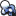
* `ClassIcon.Brush` 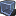
* `ClassIcon.BrushAdditive` 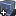
* `ClassIcon.BrushSubtractive` 
* `ClassIcon.Volume` 
* `ClassIcon.GroupActor` 
* `ClassIcon.VectorFieldVolume` 
* `ClassIcon.Deleted` 
* `ClassIcon.StaticMeshActor` 
* `ClassIcon.SkeletalMeshActor` 
* `ClassIcon.LevelScriptActor` 
* `ClassIcon.AudioComponent` 
* `ClassIcon.CameraComponent` 
* `ClassIcon.BlueprintCore` 
* `ClassIcon.BrushComponent` 
* `ClassIcon.DecalComponent` 
* `ClassIcon.DirectionalLightComponent` 
* `ClassIcon.ExponentialHeightFogComponent` 
* `ClassIcon.ForceFeedbackComponent` 
* `ClassIcon.LandscapeComponent` 
* `ClassIcon.LightComponent` 
* `ClassIcon.ParticleSystemComponent` 
* `ClassIcon.PointLightComponent` 
* `ClassIcon.RB_RadialForceComponent` 
* `ClassIcon.SingleAnimSkeletalComponent` 
* `ClassIcon.SkeletalMeshComponent` 
* `ClassIcon.SpotLightComponent` 
* `ClassIcon.StaticMeshComponent` 
* `ClassIcon.VectorFieldComponent` 
* `ClassIcon.ArrowComponent` 
* `ClassIcon.AtmosphericFogComponent` 
* `ClassIcon.SkyAtmosphereComponent` 
* `ClassIcon.BoxComponent` 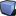
* `ClassIcon.CapsuleComponent` 
* `ClassIcon.InstancedStaticMeshComponent` 
* `ClassIcon.MaterialBillboardComponent` 
* `ClassIcon.SceneCaptureComponent2D` 
* `ClassIcon.SceneCaptureComponent` 
* `ClassIcon.SceneComponent` 
* `ClassIcon.SphereComponent` 
* `ClassIcon.SplineComponent` 
* `ClassIcon.BillboardComponent` 
* `ClassIcon.TextRenderComponent` 
* `ClassIcon.TimelineComponent` 
* `ClassIcon.ChildActorComponent` 
* `ClassIcon.ComponentMobilityStaticPip` 
* `ClassIcon.ComponentMobilityStationaryPip` 
* `ClassIcon.ComponentMobilityMovablePip` 
* `ClassIcon.MovableMobilityIcon` 
* `ClassIcon.StationaryMobilityIcon` 
* `ClassIcon.ComponentMobilityHeaderIcon` 
* `ClassIcon.AnimInstance` 
* `ClassIcon.PaperSprite` 
* `ClassThumbnail.PaperSprite` 
* `ClassIcon.PaperSpriteComponent` 
* `ClassThumbnail.PaperSpriteComponent` 
* `ClassIcon.PaperSpriteActor` 
* `ClassThumbnail.PaperSpriteActor` 
* `ClassIcon.PaperFlipbook` 
* `ClassThumbnail.PaperFlipbook` 
* `ClassIcon.PaperFlipbookComponent` 
* `ClassThumbnail.PaperFlipbookComponent` 
* `ClassIcon.PaperFlipbookActor` 
* `ClassThumbnail.PaperFlipbookActor` 
* `ClassIcon.PaperTileMap` 
* `ClassThumbnail.PaperTileMap` 
* `ClassIcon.PaperTileMapComponent` 
* `ClassThumbnail.PaperTileMapComponent` 
* `ClassIcon.PaperTileMapActor` 
* `ClassThumbnail.PaperTileMapActor` 
* `ClassIcon.PaperSpriteAtlas` 
* `ClassThumbnail.PaperSpriteAtlas` 
* `ClassIcon.PaperCharacter` 
* `ClassThumbnail.PaperCharacter` 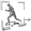
* `ClassIcon.PaperTileSet` 
* `ClassThumbnail.PaperTileSet` 
* `ClassIcon.PaperTerrainMaterial` 
* `ClassThumbnail.PaperTerrainMaterial` 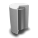
* `ClassIcon.PaperTerrainComponent` 
* `ClassThumbnail.PaperTerrainComponent` 
* `ClassIcon.PaperTerrainActor` 
* `ClassThumbnail.PaperTerrainActor` 
* `ClassIcon.ActorFactoryBoxVolume` 
* `ClassIcon.ActorFactoryCylinderVolume` 
* `ClassIcon.ActorFactorySphereVolume` 
* `ContentBrowser.TabIcon` 
* `ContentBrowser.AssetTreeFolderClosed` 
* `ContentBrowser.BreadcrumbPathPickerFolder` 
* `ContentBrowser.AssetTreeFolderOpen` 
* `ContentBrowser.AssetTreeFolderDeveloper` 
* `ContentBrowser.AssetTreeFolderOpenCode` 
* `ContentBrowser.AssetTreeFolderClosedCode` 
* `ContentBrowser.AddCollectionButtonIcon` 
* `ContentBrowser.SortUp` 
* `ContentBrowser.SortDown` 
* `ContentBrowser.Sources.Paths` 
* `ContentBrowser.Sources.Collections` 
* `ContentBrowser.Sources.Collections.Compact` 
* `ContentBrowser.PrimitiveCustom` 
* `ContentBrowser.PrimitiveSphere` 
* `ContentBrowser.PrimitiveCube` 
* `ContentBrowser.PrimitivePlane` 
* `ContentBrowser.PrimitiveCylinder` 
* `ContentBrowser.ResetPrimitiveToDefault` 
* `ContentBrowser.NewAsset` 
* `ContentBrowser.PathActions.NewAsset` 
* `ContentBrowser.PathActions.SetColor` 
* `ContentBrowser.SaveDirtyPackages` 
* `ContentBrowser.AddContent` 
* `ContentBrowser.ImportPackage` 
* `ContentBrowser.ImportIcon` 
* `ContentBrowser.AssetActions` 
* `ContentBrowser.AssetActions.Edit` 
* `ContentBrowser.AssetActions.Delete` 
* `ContentBrowser.AssetActions.Delete` 
* `ContentBrowser.AssetActions.Rename` 
* `ContentBrowser.AssetActions.Duplicate` 
* `ContentBrowser.AssetActions.OpenSourceLocation` 
* `ContentBrowser.AssetActions.OpenInExternalEditor` 
* `ContentBrowser.AssetActions.ReimportAsset` 
* `ContentBrowser.AssetActions.GoToCodeForAsset` 
* `ContentBrowser.AssetActions.FindAssetInWorld` 
* `ContentBrowser.AssetActions.CreateThumbnail` 
* `ContentBrowser.AssetActions.DeleteThumbnail` 
* `ContentBrowser.AssetActions.GenericFind` 
* `ContentBrowser.AssetLocalization` 
* `MediaAsset.AssetActions.Play.Small` 
* `MediaAsset.AssetActions.Stop.Small` 
* `MediaAsset.AssetActions.Pause.Small` 
* `MediaAsset.AssetActions.Solo.Small` 
* `MediaAsset.AssetActions.Mute.Small` 
* `MediaAsset.AssetActions.Play.Large` 
* `MediaAsset.AssetActions.Stop.Large` 
* `MediaAsset.AssetActions.Pause.Large` 
* `MediaAsset.AssetActions.Solo.Large` 
* `MediaAsset.AssetActions.Mute.Large` 
* `ContentBrowser.ColumnViewAssetIcon` 
* `ContentBrowser.ColumnViewFolderIcon` 
* `ContentBrowser.ColumnViewDeveloperFolderIcon` 
* `ContentBrowser.ListViewFolderIcon.Base` 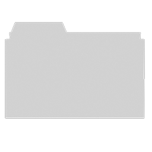
* `ContentBrowser.ListViewFolderIcon.Mask` 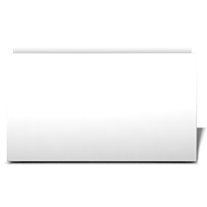
* `ContentBrowser.ListViewDeveloperFolderIcon.Base` 
* `ContentBrowser.ListViewDeveloperFolderIcon.Mask` 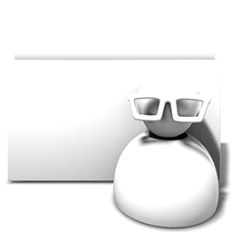
* `ContentBrowser.TileViewFolderIcon.Base` 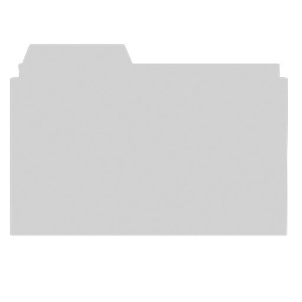
* `ContentBrowser.TileViewFolderIcon.Mask` 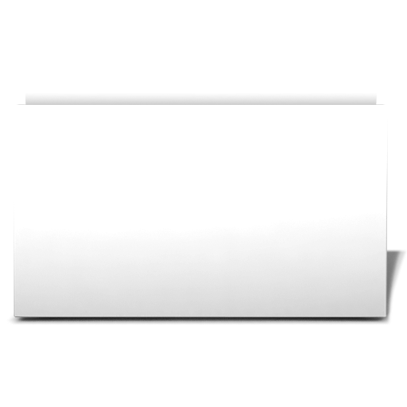
* `ContentBrowser.TileViewDeveloperFolderIcon.Base` 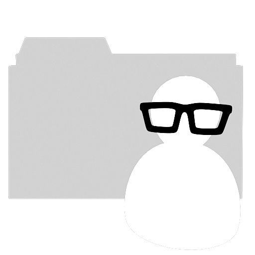
* `ContentBrowser.TileViewDeveloperFolderIcon.Mask` 
* `ContentBrowser.Sources` 
* `ContentBrowser.PathDelimiter` 
* `ContentBrowser.LockButton_Locked` 
* `ContentBrowser.LockButton_Unlocked` 
* `ContentBrowser.ShowSourcesView` 
* `ContentBrowser.HideSourcesView` 
* `ContentBrowser.HistoryBack` 
* `ContentBrowser.HistoryForward` 
* `ContentBrowser.DirectoryUp` 
* `ContentBrowser.PathPickerButton` 
* `ContentBrowser.SCC_CheckedOut` 
* `ContentBrowser.SCC_OpenForAdd` 
* `ContentBrowser.SCC_CheckedOutByOtherUser` 
* `ContentBrowser.SCC_CheckedOutByOtherUserOtherBranch` 
* `ContentBrowser.SCC_ModifiedOtherBranch` 
* `ContentBrowser.SCC_NotAtHeadRevision` 
* `ContentBrowser.SCC_NotInDepot` 
* `ContentBrowser.SCC_CheckedOut_Small` 
* `ContentBrowser.SCC_OpenForAdd_Small` 
* `ContentBrowser.SCC_CheckedOutByOtherUser_Small` 
* `ContentBrowser.SCC_CheckedOutByOtherUserOtherBranch_Small` 
* `ContentBrowser.SCC_ModifiedOtherBranch_Small` 
* `ContentBrowser.SCC_NotAtHeadRevision_Small` 
* `ContentBrowser.SCC_NotInDepot_Small` 
* `ContentBrowser.ContentDirty` 
* `ContentBrowser.PopupMessageIcon` 
* `ContentBrowser.NewFolderIcon` 
* `ContentBrowser.Local` 
* `ContentBrowser.Local.Small` 
* `ContentBrowser.Local.Large` 
* `ContentBrowser.Shared` 
* `ContentBrowser.Shared.Small` 
* `ContentBrowser.Shared.Large` 
* `ContentBrowser.Private` 
* `ContentBrowser.Private.Small` 
* `ContentBrowser.Private.Large` 
* `ContentBrowser.CollectionStatus` 
* `ContentBrowser.SaveAllCurrentFolder` 
* `ContentBrowser.ResaveAllCurrentFolder` 
* `LandscapeEditor.ManageMode` 
* `LandscapeEditor.SculptMode` 
* `LandscapeEditor.PaintMode` 
* `LandscapeEditor.ManageMode.Small` 
* `LandscapeEditor.SculptMode.Small` 
* `LandscapeEditor.PaintMode.Small` 
* `LandscapeEditor.NewLandscape` 
* `LandscapeEditor.NewLandscape.Small` 
* `LandscapeEditor.ResizeLandscape` 
* `LandscapeEditor.ResizeLandscape.Small` 
* `LandscapeEditor.SculptTool` 
* `LandscapeEditor.PaintTool` 
* `LandscapeEditor.SmoothTool` 
* `LandscapeEditor.FlattenTool` 
* `LandscapeEditor.RampTool` 
* `LandscapeEditor.ErosionTool` 
* `LandscapeEditor.HydroErosionTool` 
* `LandscapeEditor.NoiseTool` 
* `LandscapeEditor.RetopologizeTool` 
* `LandscapeEditor.VisibilityTool` 
* `LandscapeEditor.BlueprintBrushTool` 
* `LandscapeEditor.SculptTool.Small` 
* `LandscapeEditor.EraseTool.Small` 
* `LandscapeEditor.PaintTool.Small` 
* `LandscapeEditor.SmoothTool.Small` 
* `LandscapeEditor.FlattenTool.Small` 
* `LandscapeEditor.RampTool.Small` 
* `LandscapeEditor.ErosionTool.Small` 
* `LandscapeEditor.HydroErosionTool.Small` 
* `LandscapeEditor.NoiseTool.Small` 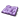
* `LandscapeEditor.RetopologizeTool.Small` 
* `LandscapeEditor.VisibilityTool.Small` 
* `LandscapeEditor.BlueprintBrushTool.Small` 
* `LandscapeEditor.SelectComponentTool` 
* `LandscapeEditor.AddComponentTool` 
* `LandscapeEditor.DeleteComponentTool` 
* `LandscapeEditor.MoveToLevelTool` 
* `LandscapeEditor.SelectComponentTool.Small` 
* `LandscapeEditor.AddComponentTool.Small` 
* `LandscapeEditor.DeleteComponentTool.Small` 
* `LandscapeEditor.MoveToLevelTool.Small` 
* `LandscapeEditor.RegionSelectTool` 
* `LandscapeEditor.RegionCopyPasteTool` 
* `LandscapeEditor.RegionSelectTool.Small` 
* `LandscapeEditor.RegionCopyPasteTool.Small` 
* `LandscapeEditor.MirrorTool` 
* `LandscapeEditor.MirrorTool.Small` 
* `LandscapeEditor.SplineTool` 
* `LandscapeEditor.SplineTool.Small` 
* `LandscapeEditor.CircleBrush` 
* `LandscapeEditor.AlphaBrush` 
* `LandscapeEditor.AlphaBrush_Pattern` 
* `LandscapeEditor.ComponentBrush` 
* `LandscapeEditor.GizmoBrush` 
* `LandscapeEditor.CircleBrush.Small` 
* `LandscapeEditor.AlphaBrush.Small` 
* `LandscapeEditor.AlphaBrush_Pattern.Small` 
* `LandscapeEditor.ComponentBrush.Small` 
* `LandscapeEditor.GizmoBrush.Small` 
* `LandscapeEditor.CircleBrush_Smooth` 
* `LandscapeEditor.CircleBrush_Linear` 
* `LandscapeEditor.CircleBrush_Spherical` 
* `LandscapeEditor.CircleBrush_Tip` 
* `LandscapeEditor.CircleBrush_Smooth.Small` 
* `LandscapeEditor.CircleBrush_Linear.Small` 
* `LandscapeEditor.CircleBrush_Spherical.Small` 
* `LandscapeEditor.CircleBrush_Tip.Small` 
* `LandscapeEditor.Brushes.Alpha.UseRChannel` 
* `LandscapeEditor.Brushes.Alpha.UseGChannel` 
* `LandscapeEditor.Brushes.Alpha.UseBChannel` 
* `LandscapeEditor.Brushes.Alpha.UseAChannel` 
* `LandscapeEditor.Brush.AffectsHeight.Enabled` 
* `LandscapeEditor.Brush.AffectsHeight.Disabled` 
* `LandscapeEditor.Brush.AffectsWeight.Enabled` 
* `LandscapeEditor.Brush.AffectsWeight.Disabled` 
* `LandscapeEditor.Target_Heightmap` 
* `LandscapeEditor.Target_Visibility` 
* `LandscapeEditor.Target_Invalid` 
* `LandscapeEditor.Target_Create` 
* `LandscapeEditor.Target_MakePublic` 
* `LandscapeEditor.Target_Delete` 
* `LandscapeEditor.Target_DisplayOrder.Default` 
* `LandscapeEditor.Target_DisplayOrder.Alphabetical` 
* `LandscapeEditor.Target_DisplayOrder.Custom` 
* `ToolkitDisplay.UnsavedChangeIcon` 
* `ToolkitDisplay.MenuDropdown` 
* `GenericEditor.Tabs.Properties` 
* `CurveTableEditor.Tabs.Properties` 
* `DataTableEditor.Tabs.Properties` 
* `DataTableEditor.Copy` 
* `DataTableEditor.Paste` 
* `DataTableEditor.Duplicate` 
* `DataTableEditor.Save` 
* `DataTableEditor.Browse` 
* `DataTableEditor.Add` 
* `DataTableEditor.Remove` 
* `DataTableEditor.Copy.Small` 
* `DataTableEditor.Paste.Small` 
* `DataTableEditor.Duplicate.Small` 
* `DataTableEditor.Add.Small` 
* `DataTableEditor.Remove.Small` 
* `StringTableEditor.Tabs.Properties` 
* `MaterialEditor.Tabs.HLSLCode` 
* `MaterialEditor.Apply` 
* `MaterialEditor.Apply.Small` 
* `MaterialEditor.ShowAllMaterialParameters` 
* `MaterialEditor.ShowAllMaterialParameters.Small` 
* `MaterialEditor.SetCylinderPreview` 
* `MaterialEditor.SetCylinderPreview.Small` 
* `MaterialEditor.SetSpherePreview` 
* `MaterialEditor.SetSpherePreview.Small` 
* `MaterialEditor.SetPlanePreview` 
* `MaterialEditor.SetPlanePreview.Small` 
* `MaterialEditor.SetCubePreview` 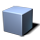
* `MaterialEditor.SetCubePreview.Small` 
* `MaterialEditor.SetPreviewMeshFromSelection` 
* `MaterialEditor.SetPreviewMeshFromSelection.Small` 
* `MaterialEditor.TogglePreviewGrid` 
* `MaterialEditor.TogglePreviewGrid.Small` 
* `MaterialEditor.ToggleMaterialStats` 
* `MaterialEditor.ToggleMaterialStats.Small` 
* `MaterialEditor.ToggleMaterialStats.Tab` 
* `MaterialEditor.ToggleBuiltinStats` 
* `MaterialEditor.ToggleBuiltinStats.Small` 
* `MaterialEditor.TogglePlatformStats` 
* `MaterialEditor.TogglePlatformStats.Small` 
* `MaterialEditor.CleanUnusedExpressions` 
* `MaterialEditor.CleanUnusedExpressions.Small` 
* `MaterialEditor.ToggleRealtimeExpressions` 
* `MaterialEditor.ToggleRealtimeExpressions.Small` 
* `MaterialEditor.AlwaysRefreshAllPreviews` 
* `MaterialEditor.AlwaysRefreshAllPreviews.Small` 
* `MaterialEditor.ToggleLivePreview` 
* `MaterialEditor.ToggleLivePreview.Small` 
* `MaterialEditor.ShowHideConnectors` 
* `MaterialEditor.ShowHideConnectors.Small` 
* `MaterialEditor.CameraHome` 
* `MaterialEditor.CameraHome.Small` 
* `MaterialEditor.FindInMaterial` 
* `MaterialEditor.FindInMaterial.Small` 
* `MaterialEditor.AddSubstanceSpecialToolBar` 
* `MaterialEditor.AddSubstanceSpecialMenu` 
* `MaterialInstanceEditor.Tabs.Properties` 
* `MaterialInstanceEditor.Tabs.Parents` 
* `SoundClassEditor.Tabs.Properties` 
* `SoundClassEditor.ToggleSolo` 
* `SoundClassEditor.ToggleSolo.Small` 
* `SoundClassEditor.ToggleMute` 
* `SoundClassEditor.ToggleMute.Small` 
* `FontEditor.Tabs.Preview` 
* `FontEditor.Tabs.Properties` 
* `FontEditor.Tabs.PageProperties` 
* `FontEditor.Update` 
* `FontEditor.Update.Small` 
* `FontEditor.UpdateAll` 
* `FontEditor.UpdateAll.Small` 
* `FontEditor.ExportPage` 
* `FontEditor.ExportPage.Small` 
* `FontEditor.ExportAllPages` 
* `FontEditor.ExportAllPages.Small` 
* `FontEditor.FontBackgroundColor` 
* `FontEditor.FontBackgroundColor.Small` 
* `FontEditor.FontForegroundColor` 
* `FontEditor.FontForegroundColor.Small` 
* `FontEditor.Button_Add` 
* `FontEditor.Button_Delete` 
* `SoundCueGraphEditor.PlayCue` 
* `SoundCueGraphEditor.PlayCue.Small` 
* `SoundCueGraphEditor.PlayNode` 
* `SoundCueGraphEditor.PlayNode.Small` 
* `SoundCueGraphEditor.StopCueNode` 
* `SoundCueGraphEditor.StopCueNode.Small` 
* `SoundCueGraphEditor.ToggleSolo` 
* `SoundCueGraphEditor.ToggleSolo.Small` 
* `SoundCueGraphEditor.ToggleMute` 
* `SoundCueGraphEditor.ToggleMute.Small` 
* `StaticMeshEditor.Tabs.Properties` 
* `StaticMeshEditor.Tabs.SocketManager` 
* `StaticMeshEditor.Tabs.ConvexDecomposition` 
* `StaticMeshEditor.SetShowWireframe` 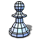
* `StaticMeshEditor.SetShowWireframe.Small` 
* `StaticMeshEditor.SetShowVertexColor` 
* `StaticMeshEditor.SetShowVertexColor.Small` 
* `StaticMeshEditor.SetRealtimePreview` 
* `StaticMeshEditor.SetRealtimePreview.Small` 
* `StaticMeshEditor.SetShowBounds` 
* `StaticMeshEditor.SetShowBounds.Small` 
* `StaticMeshEditor.SetShowCollision` 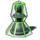
* `StaticMeshEditor.SetShowCollision.Small` 
* `StaticMeshEditor.SetShowGrid` 
* `StaticMeshEditor.SetShowGrid.Small` 
* `StaticMeshEditor.SetDrawUVs` 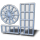
* `StaticMeshEditor.SetDrawUVs.Small` 
* `StaticMeshEditor.ResetCamera` 
* `StaticMeshEditor.ResetCamera.Small` 
* `StaticMeshEditor.SetShowPivot` 
* `StaticMeshEditor.SetShowPivot.Small` 
* `StaticMeshEditor.SetShowSockets` 
* `StaticMeshEditor.SetShowSockets.Small` 
* `StaticMeshEditor.SaveThumbnail` 
* `StaticMeshEditor.SaveThumbnail.Small` 
* `StaticMeshEditor.SetShowNormals` 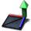
* `StaticMeshEditor.SetShowNormals.Small` 
* `StaticMeshEditor.SetShowTangents` 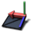
* `StaticMeshEditor.SetShowTangents.Small` 
* `StaticMeshEditor.SetShowBinormals` 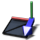
* `StaticMeshEditor.SetShowBinormals.Small` 
* `StaticMeshEditor.SetDrawAdditionalData` 
* `StaticMeshEditor.SetDrawAdditionalData.Small` 
* `StaticMeshEditor.SetShowVertices` 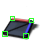
* `StaticMeshEditor.SetShowVertices.Small` 
* `TextureEditor.Tabs.Properties` 
* `TextureEditor.RedChannel` 
* `TextureEditor.RedChannel.Small` 
* `TextureEditor.GreenChannel` 
* `TextureEditor.GreenChannel.Small` 
* `TextureEditor.BlueChannel` 
* `TextureEditor.BlueChannel.Small` 
* `TextureEditor.AlphaChannel` 
* `TextureEditor.AlphaChannel.Small` 
* `TextureEditor.Saturation` 
* `TextureEditor.Saturation.Small` 
* `TextureEditor.CompressNow` 
* `TextureEditor.CompressNow.Small` 
* `TextureEditor.Reimport` 
* `TextureEditor.Reimport.Small` 
* `Cascade.Tabs.Properties` 
* `Cascade.RestartSimulation` 
* `Cascade.RestartInLevel` 
* `Cascade.SaveThumbnailImage` 
* `Cascade.Undo` 
* `Cascade.Redo` 
* `Cascade.ToggleBounds` 
* `Cascade.ToggleOriginAxis` 
* `Cascade.CascadeBackgroundColor` 
* `Cascade.RegenerateLowestLODDuplicatingHighest` 
* `Cascade.RegenerateLowestLOD` 
* `Cascade.JumpToHighestLOD` 
* `Cascade.JumpToHigherLOD` 
* `Cascade.AddLODAfterCurrent` 
* `Cascade.AddLODBeforeCurrent` 
* `Cascade.JumpToLowerLOD` 
* `Cascade.JumpToLowestLOD` 
* `Cascade.DeleteLOD` 
* `Cascade.RestartSimulation.Small` 
* `Cascade.RestartInLevel.Small` 
* `Cascade.SaveThumbnailImage.Small` 
* `Cascade.Undo.Small` 
* `Cascade.Redo.Small` 
* `Cascade.ToggleBounds.Small` 
* `Cascade.ToggleOriginAxis.Small` 
* `Cascade.CascadeBackgroundColor.Small` 
* `Cascade.RegenerateLowestLODDuplicatingHighest.Small` 
* `Cascade.RegenerateLowestLOD.Small` 
* `Cascade.JumpToHighestLOD.Small` 
* `Cascade.JumpToHigherLOD.Small` 
* `Cascade.AddLODAfterCurrent.Small` 
* `Cascade.AddLODBeforeCurrent.Small` 
* `Cascade.JumpToLowerLOD.Small` 
* `Cascade.JumpToLowestLOD.Small` 
* `Cascade.DeleteLOD.Small` 
* `LevelScript.Delete` 
* `CurveAssetEditor.Tabs.Properties` 
* `CurveEditor.FitHorizontally` 
* `CurveEditor.FitVertically` 
* `CurveEditor.Fit` 
* `CurveEditor.PanMode` 
* `CurveEditor.ZoomMode` 
* `CurveEditor.CurveAuto` 
* `CurveEditor.CurveAutoClamped` 
* `CurveEditor.CurveUser` 
* `CurveEditor.CurveBreak` 
* `CurveEditor.CurveWeight` 
* `CurveEditor.CurveNonWeight` 
* `CurveEditor.Linear` 
* `CurveEditor.Constant` 
* `CurveEditor.FlattenTangents` 
* `CurveEditor.StraightenTangents` 
* `CurveEditor.ShowAllTangents` 
* `CurveEditor.CreateTab` 
* `CurveEditor.DeleteTab` 
* `CurveEditor.FitHorizontally.Small` 
* `CurveEditor.FitVertically.Small` 
* `CurveEditor.Fit.Small` 
* `CurveEditor.PanMode.Small` 
* `CurveEditor.ZoomMode.Small` 
* `CurveEditor.CurveAuto.Small` 
* `CurveEditor.CurveAutoClamped.Small` 
* `CurveEditor.CurveUser.Small` 
* `CurveEditor.CurveBreak.Small` 
* `CurveEditor.CurveWeight.Small` 
* `CurveEditor.CurveNonWeight.Small` 
* `CurveEditor.Linear.Small` 
* `CurveEditor.Constant.Small` 
* `CurveEditor.FlattenTangents.Small` 
* `CurveEditor.StraightenTangents.Small` 
* `CurveEditor.ShowAllTangents.Small` 
* `CurveEditor.CreateTab.Small` 
* `CurveEditor.DeleteTab.Small` 
* `GenericCurveEditor.TabIcon` 
* `GenericCurveEditor.ZoomToFit` 
* `GenericCurveEditor.ZoomToFit.Small` 
* `GenericCurveEditor.ToggleInputSnapping` 
* `GenericCurveEditor.ToggleInputSnapping.Small` 
* `GenericCurveEditor.ToggleOutputSnapping` 
* `GenericCurveEditor.ToggleOutputSnapping.Small` 
* `GenericCurveEditor.InterpolationCubicAuto` 
* `GenericCurveEditor.InterpolationCubicAuto.Small` 
* `GenericCurveEditor.InterpolationCubicUser` 
* `GenericCurveEditor.InterpolationCubicUser.Small` 
* `GenericCurveEditor.InterpolationCubicBreak` 
* `GenericCurveEditor.InterpolationCubicBreak.Small` 
* `GenericCurveEditor.InterpolationToggleWeighted` 
* `GenericCurveEditor.InterpolationToggleWeighted.Small` 
* `GenericCurveEditor.InterpolationLinear` 
* `GenericCurveEditor.InterpolationLinear.Small` 
* `GenericCurveEditor.InterpolationConstant` 
* `GenericCurveEditor.InterpolationConstant.Small` 
* `GenericCurveEditor.FlattenTangents` 
* `GenericCurveEditor.FlattenTangents.Small` 
* `GenericCurveEditor.StraightenTangents` 
* `GenericCurveEditor.StraightenTangents.Small` 
* `GenericCurveEditor.SetViewModeAbsolute` 
* `GenericCurveEditor.SetViewModeAbsolute.Small` 
* `GenericCurveEditor.SetViewModeStacked` 
* `GenericCurveEditor.SetViewModeStacked.Small` 
* `GenericCurveEditor.SetViewModeNormalized` 
* `GenericCurveEditor.SetViewModeNormalized.Small` 
* `GenericCurveEditor.SetAxisSnappingNone` 
* `GenericCurveEditor.SetAxisSnappingNone.Small` 
* `GenericCurveEditor.SetAxisSnappingHorizontal` 
* `GenericCurveEditor.SetAxisSnappingHorizontal.Small` 
* `GenericCurveEditor.SetAxisSnappingVertical` 
* `GenericCurveEditor.SetAxisSnappingVertical.Small` 
* `GenericCurveEditor.DeactivateCurrentTool` 
* `GenericCurveEditor.DeactivateCurrentTool.Small` 
* `GenericCurveEditor.OpenUserImplementableFilterWindow` 
* `GenericCurveEditor.OpenUserImplementableFilterWindow.Small` 
* `GenericCurveEditor.Key` 
* `GenericCurveEditor.ConstantKey` 
* `GenericCurveEditor.LinearKey` 
* `GenericCurveEditor.CubicKey` 
* `GenericCurveEditor.TangentHandle` 
* `GenericCurveEditor.WeightedTangentCubicKey` 
* `GenericCurveEditor.SetPreInfinityExtrapConstant` 
* `GenericCurveEditor.SetPreInfinityExtrapConstant.Small` 
* `GenericCurveEditor.SetPreInfinityExtrapCycle` 
* `GenericCurveEditor.SetPreInfinityExtrapCycle.Small` 
* `GenericCurveEditor.SetPreInfinityExtrapCycleWithOffset` 
* `GenericCurveEditor.SetPreInfinityExtrapCycleWithOffset.Small` 
* `GenericCurveEditor.SetPreInfinityExtrapLinear` 
* `GenericCurveEditor.SetPreInfinityExtrapLinear.Small` 
* `GenericCurveEditor.SetPreInfinityExtrapOscillate` 
* `GenericCurveEditor.SetPreInfinityExtrapOscillate.Small` 
* `GenericCurveEditor.PreInfinityMixed` 
* `GenericCurveEditor.PreInfinityMixed.Small` 
* `GenericCurveEditor.SetPostInfinityExtrapConstant` 
* `GenericCurveEditor.SetPostInfinityExtrapConstant.Small` 
* `GenericCurveEditor.SetPostInfinityExtrapCycle` 
* `GenericCurveEditor.SetPostInfinityExtrapCycle.Small` 
* `GenericCurveEditor.SetPostInfinityExtrapCycleWithOffset` 
* `GenericCurveEditor.SetPostInfinityExtrapCycleWithOffset.Small` 
* `GenericCurveEditor.SetPostInfinityExtrapLinear` 
* `GenericCurveEditor.SetPostInfinityExtrapLinear.Small` 
* `GenericCurveEditor.SetPostInfinityExtrapOscillate` 
* `GenericCurveEditor.SetPostInfinityExtrapOscillate.Small` 
* `GenericCurveEditor.PostInfinityMixed` 
* `GenericCurveEditor.PostInfinityMixed.Small` 
* `GenericCurveEditor.VisibilityOptions` 
* `GenericCurveEditor.VisibilityOptions.Small` 
* `GenericCurveEditor.Pin_Active` 
* `GenericCurveEditor.Pin_Inactive` 
* `CurveEditorTools.SetFocusPlaybackTime` 
* `CurveEditorTools.SetFocusPlaybackTime.Small` 
* `CurveEditorTools.SetFocusPlaybackRange` 
* `CurveEditorTools.SetFocusPlaybackRange.Small` 
* `CurveEditorTools.ActivateTransformTool` 
* `CurveEditorTools.ActivateTransformTool.Small` 
* `CurveEditorTools.ActivateRetimeTool` 
* `CurveEditorTools.ActivateRetimeTool.Small` 
* `CurveEditorTools.ActivateMultiScaleTool` 
* `CurveEditorTools.ActivateMultiScaleTool.Small` 
* `PhysicsAssetEditor.Tabs.Properties` 
* `PhysicsAssetEditor.Tabs.Hierarchy` 
* `PhysicsAssetEditor.Tabs.Profiles` 
* `PhysicsAssetEditor.Tabs.Graph` 
* `PhysicsAssetEditor.Tabs.Tools` 
* `PhysicsAssetEditor.EditingMode_Body` 
* `PhysicsAssetEditor.EditingMode_Constraint` 
* `PhysicsAssetEditor.EditingMode_Body.Small` 
* `PhysicsAssetEditor.EditingMode_Constraint.Small` 
* `PhysicsAssetEditor.SimulationNoGravity` 
* `PhysicsAssetEditor.SelectedSimulation` 
* `PhysicsAssetEditor.SimulationAll` 
* `PhysicsAssetEditor.Undo` 
* `PhysicsAssetEditor.Redo` 
* `PhysicsAssetEditor.ChangeDefaultMesh` 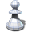
* `PhysicsAssetEditor.ApplyPhysicalMaterial` 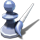
* `PhysicsAssetEditor.CopyJointSettings` 
* `PhysicsAssetEditor.PlayAnimation` 
* `PhysicsAssetEditor.PhATTranslationMode` 
* `PhysicsAssetEditor.PhATRotationMode` 
* `PhysicsAssetEditor.PhATScaleMode` 
* `PhysicsAssetEditor.Snap` 
* `PhysicsAssetEditor.CopyProperties` 
* `PhysicsAssetEditor.DisableCollision` 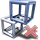
* `PhysicsAssetEditor.EnableCollision` 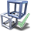
* `PhysicsAssetEditor.DisableCollisionAll` 
* `PhysicsAssetEditor.EnableCollisionAll` 
* `PhysicsAssetEditor.WeldToBody` 
* `PhysicsAssetEditor.AddNewBody` 
* `PhysicsAssetEditor.AddSphere` 
* `PhysicsAssetEditor.AddSphyl` 
* `PhysicsAssetEditor.AddBox` 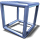
* `PhysicsAssetEditor.AddTaperedCapsule` 
* `PhysicsAssetEditor.DeletePrimitive` 
* `PhysicsAssetEditor.DuplicatePrimitive` 
* `PhysicsAssetEditor.ResetConstraint` 
* `PhysicsAssetEditor.SnapConstraint` 
* `PhysicsAssetEditor.SnapAllConstraints` 
* `PhysicsAssetEditor.ConvertToBallAndSocket` 
* `PhysicsAssetEditor.ConvertToHinge` 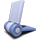
* `PhysicsAssetEditor.ConvertToPrismatic` 
* `PhysicsAssetEditor.ConvertToSkeletal` 
* `PhysicsAssetEditor.DeleteConstraint` 
* `PhysicsAssetEditor.SimulationNoGravity.Small` 
* `PhysicsAssetEditor.SelectedSimulation.Small` 
* `PhysicsAssetEditor.SimulationAll.Small` 
* `PhysicsAssetEditor.Undo.Small` 
* `PhysicsAssetEditor.Redo.Small` 
* `PhysicsAssetEditor.ChangeDefaultMesh.Small` 
* `PhysicsAssetEditor.ResetEntireAsset.Small` 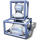
* `PhysicsAssetEditor.ResetBoneCollision.Small` 
* `PhysicsAssetEditor.ApplyPhysicalMaterial.Small` 
* `PhysicsAssetEditor.CopyJointSettings.Small` 
* `PhysicsAssetEditor.PlayAnimation.Small` 
* `PhysicsAssetEditor.PhATTranslationMode.Small` 
* `PhysicsAssetEditor.PhATRotationMode.Small` 
* `PhysicsAssetEditor.PhATScaleMode.Small` 
* `PhysicsAssetEditor.Snap.Small` 
* `PhysicsAssetEditor.CopyProperties.Small` 
* `PhysicsAssetEditor.DisableCollision.Small` 
* `PhysicsAssetEditor.EnableCollision.Small` 
* `PhysicsAssetEditor.DisableCollisionAll.Small` 
* `PhysicsAssetEditor.EnableCollisionAll.Small` 
* `PhysicsAssetEditor.WeldToBody.Small` 
* `PhysicsAssetEditor.AddNewBody.Small` 
* `PhysicsAssetEditor.AddSphere.Small` 
* `PhysicsAssetEditor.AddSphyl.Small` 
* `PhysicsAssetEditor.AddBox.Small` 
* `PhysicsAssetEditor.AddTaperedCapsule.Small` 
* `PhysicsAssetEditor.DeletePrimitive.Small` 
* `PhysicsAssetEditor.DuplicatePrimitive.Small` 
* `PhysicsAssetEditor.ResetConstraint.Small` 
* `PhysicsAssetEditor.SnapConstraint.Small` 
* `PhysicsAssetEditor.SnapAllConstraints.Small` 
* `PhysicsAssetEditor.ConvertToBallAndSocket.Small` 
* `PhysicsAssetEditor.ConvertToHinge.Small` 
* `PhysicsAssetEditor.ConvertToPrismatic.Small` 
* `PhysicsAssetEditor.ConvertToSkeletal.Small` 
* `PhysicsAssetEditor.DeleteConstraint.Small` 
* `PhysicsAssetEditor.NewPhysicalAnimationProfile` 
* `PhysicsAssetEditor.DeleteCurrentPhysicalAnimationProfile` 
* `PhysicsAssetEditor.AddBodyToPhysicalAnimationProfile` 
* `PhysicsAssetEditor.RemoveBodyFromPhysicalAnimationProfile` 
* `PhysicsAssetEditor.NewConstraintProfile` 
* `PhysicsAssetEditor.DeleteCurrentConstraintProfile` 
* `PhysicsAssetEditor.AddConstraintToCurrentConstraintProfile` 
* `PhysicsAssetEditor.RemoveConstraintFromCurrentConstraintProfile` 
* `PhysicsAssetEditor.Tree.Body` 
* `PhysicsAssetEditor.Tree.KinematicBody` 
* `PhysicsAssetEditor.Tree.EmptyBody` 
* `PhysicsAssetEditor.Tree.Bone` 
* `PhysicsAssetEditor.Tree.Sphere` 
* `PhysicsAssetEditor.Tree.Sphyl` 
* `PhysicsAssetEditor.Tree.Box` 
* `PhysicsAssetEditor.Tree.Convex` 
* `PhysicsAssetEditor.Tree.TaperedCapsule` 
* `PhysicsAssetEditor.Tree.Constraint` 
* `PhysicsAssetEditor.Graph.NodeIcon` 
* `PhysicsAssetEditor.Graph.Pin.Background` 
* `PhysicsAssetEditor.Graph.Pin.BackgroundHovered` 
* `Matinee.Tabs.RecordingViewport` 
* `Matinee.Tabs.CurveEditor` 
* `Matinee.Tabs.Tracks` 
* `Matinee.AddKey` 
* `Matinee.CreateMovie` 
* `Matinee.Play` 
* `Matinee.PlayLoop` 
* `Matinee.Stop` 
* `Matinee.PlayReverse` 
* `Matinee.ToggleSnap` 
* `Matinee.FitSequence` 
* `Matinee.FitViewToSelected` 
* `Matinee.FitLoop` 
* `Matinee.FitLoopSequence` 
* `Matinee.ViewEndofTrack` 
* `Matinee.ToggleSnapTimeToFrames` 
* `Matinee.FixedTimeStepPlayback` 
* `Matinee.ToggleGorePreview` 
* `Matinee.CreateCameraActor` 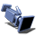
* `Matinee.LaunchRecordWindow` 
* `Matinee.ToggleCurveEditor` 
* `Matinee.ToggleDirectorTimeline` 
* `Matinee.AddKey.Small` 
* `Matinee.CreateMovie.Small` 
* `Matinee.Play.Small` 
* `Matinee.PlayLoop.Small` 
* `Matinee.Stop.Small` 
* `Matinee.PlayReverse.Small` 
* `Matinee.ToggleSnap.Small` 
* `Matinee.FitSequence.Small` 
* `Matinee.FitViewToSelected.Small` 
* `Matinee.FitLoop.Small` 
* `Matinee.FitLoopSequence.Small` 
* `Matinee.ViewEndofTrack.Small` 
* `Matinee.ToggleSnapTimeToFrames.Small` 
* `Matinee.FixedTimeStepPlayback.Small` 
* `Matinee.ToggleGorePreview.Small` 
* `Matinee.CreateCameraActor.Small` 
* `Matinee.LaunchRecordWindow.Small` 
* `Matinee.ToggleCurveEditor.Small` 
* `Matinee.ToggleDirectorTimeline.Small` 
* `SourceControl.Add` 
* `SourceControl.Edit` 
* `SourceControl.Delete` 
* `SourceControl.Branch` 
* `SourceControl.Integrate` 
* `SourceControl.StatusIcon.On` 
* `SourceControl.StatusIcon.Error` 
* `SourceControl.StatusIcon.Off` 
* `SourceControl.StatusIcon.Unknown` 
* `SourceControl.ProgressWindow.Warning` 
* `SourceControl.Actions.Sync` 
* `SourceControl.Actions.Submit` 
* `SourceControl.Actions.Diff` 
* `SourceControl.Actions.Revert` 
* `SourceControl.Actions.Connect` 
* `SourceControl.Actions.History` 
* `SourceControl.Actions.CheckOut` 
* `SourceControl.Actions.Add` 
* `SourceControl.Actions.Refresh` 
* `SourceControl.Actions.ChangeSettings` 
* `Perforce.CheckedOut` 
* `Perforce.CheckedOut_Small` 
* `Perforce.OpenForAdd` 
* `Perforce.OpenForAdd_Small` 
* `Perforce.CheckedOutByOtherUser` 
* `Perforce.CheckedOutByOtherUser_Small` 
* `Perforce.CheckedOutByOtherUserOtherBranch` 
* `Perforce.CheckedOutByOtherUserOtherBranch_Small` 
* `Perforce.ModifiedOtherBranch` 
* `Perforce.ModifiedOtherBranch_Small` 
* `Perforce.MarkedForDelete` 
* `Perforce.MarkedForDelete_Small` 
* `Perforce.NotAtHeadRevision` 
* `Perforce.NotAtHeadRevision_Small` 
* `Perforce.NotInDepot` 
* `Perforce.NotInDepot_Small` 
* `Perforce.Branched` 
* `Perforce.Branched_Small` 
* `Subversion.CheckedOut` 
* `Subversion.CheckedOut_Small` 
* `Subversion.OpenForAdd` 
* `Subversion.OpenForAdd_Small` 
* `Subversion.CheckedOutByOtherUser` 
* `Subversion.CheckedOutByOtherUser_Small` 
* `Subversion.CheckedOutByOtherUserOtherBranch` 
* `Subversion.CheckedOutByOtherUserOtherBranch_Small` 
* `Subversion.ModifiedOtherBranch` 
* `Subversion.ModifiedOtherBranch_Small` 
* `Subversion.MarkedForDelete` 
* `Subversion.MarkedForDelete_Small` 
* `Subversion.NotAtHeadRevision` 
* `Subversion.NotAtHeadRevision_Small` 
* `Subversion.NotInDepot` 
* `Subversion.NotInDepot_Small` 
* `Subversion.Branched` 
* `Subversion.Branched_Small` 
* `Automation.Success` 
* `Automation.Warning` 
* `Automation.Fail` 
* `Automation.InProcess` 
* `Automation.NotRun` 
* `Automation.NotEnoughParticipants` 
* `Automation.ParticipantsWarning` 
* `Automation.Participant` 
* `Automation.SmokeTest` 
* `Automation.SmokeTestParent` 
* `AutomationWindow.RunTests` 
* `AutomationWindow.RefreshTests` 
* `AutomationWindow.FindWorkers` 
* `AutomationWindow.StopTests` 
* `AutomationWindow.RunTests.Small` 
* `AutomationWindow.RefreshTests.Small` 
* `AutomationWindow.FindWorkers.Small` 
* `AutomationWindow.StopTests.Small` 
* `AutomationWindow.ErrorFilter` 
* `AutomationWindow.WarningFilter` 
* `AutomationWindow.SmokeTestFilter` 
* `AutomationWindow.DeveloperDirectoryContent` 
* `AutomationWindow.ErrorFilter.Small` 
* `AutomationWindow.WarningFilter.Small` 
* `AutomationWindow.SmokeTestFilter.Small` 
* `AutomationWindow.DeveloperDirectoryContent.Small` 
* `AutomationWindow.TrackHistory` 
* `AutomationWindow.GroupSettings` 
* `AutomationWindow.GroupSettings.Small` 
* `AutomationWindow.PresetNew` 
* `AutomationWindow.PresetSave` 
* `AutomationWindow.PresetRemove` 
* `Launcher.Run` 
* `Launcher.EditSettings` 
* `Launcher.Back` 
* `Launcher.Back.Small` 
* `Launcher.Delete` 
* `Launcher.Instance_Commandlet` 
* `Launcher.Instance_Editor` 
* `Launcher.Instance_Game` 
* `Launcher.Instance_Other` 
* `Launcher.Instance_Server` 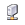
* `Launcher.Instance_Unknown` 
* `LauncherCommand.DeployBuild` 
* `LauncherCommand.QuickLaunch` 
* `LauncherCommand.CreateBuild` 
* `LauncherCommand.AdvancedBuild` 
* `LauncherCommand.AdvancedBuild.Medium` 
* `LauncherCommand.AdvancedBuild.Small` 
* `Launcher.Platform.Warning` 
* `Launcher.Platform.AllPlatforms` 
* `Launcher.Platform.AllPlatforms.Large` 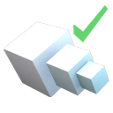
* `Launcher.Platform.AllPlatforms.XLarge` 
* `DeviceDetails.Claim` 
* `DeviceDetails.Claim.Small` 
* `DeviceDetails.Release` 
* `DeviceDetails.Release.Small` 
* `DeviceDetails.Remove` 
* `DeviceDetails.Remove.Small` 
* `DeviceDetails.Share` 
* `DeviceDetails.Share.Small` 
* `DeviceDetails.Connect` 
* `DeviceDetails.Connect.Small` 
* `DeviceDetails.Disconnect` 
* `DeviceDetails.Disconnect.Small` 
* `DeviceDetails.PowerOn` 
* `DeviceDetails.PowerOn.Small` 
* `DeviceDetails.PowerOff` 
* `DeviceDetails.PowerOff.Small` 
* `DeviceDetails.PowerOffForce` 
* `DeviceDetails.PowerOffForce.Small` 
* `DeviceDetails.Reboot` 
* `DeviceDetails.Reboot.Small` 
* `DeviceDetails.TabIcon` 
* `DeviceDetails.Tabs.Tools` 
* `DeviceDetails.Tabs.ProfileEditor` 
* `DeviceDetails.Tabs.ProfileEditorSingleProfile` 
* `SettingsEditor.Collision_Engine` 
* `SettingsEditor.Collision_Game` 
* `SettingsEditor.GoodIcon` 
* `SettingsEditor.WarningIcon` 
* `ExternalImagePicker.BlankImage` 
* `ExternalImagePicker.PickImageButton` 
* `FBXIcon.StaticMesh` 
* `FBXIcon.SkeletalMesh` 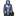
* `FBXIcon.Animation` 
* `FBXIcon.ImportOptionsOverride` 
* `FBXIcon.ImportOptionsDefault` 
* `FBXIcon.ReimportAdded` 
* `FBXIcon.ReimportRemoved` 
* `FBXIcon.ReimportSame` 
* `FBXIcon.ReimportAddedContent` 
* `FBXIcon.ReimportRemovedContent` 
* `FBXIcon.ReimportSameContent` 
* `FBXIcon.ReimportError` 
* `FBXIcon.ReimportCompareAdd` 
* `FBXIcon.ReimportCompareRemoved` 
* `WidgetDesigner.LayoutTransform` 
* `WidgetDesigner.LayoutTransform.Small` 
* `WidgetDesigner.RenderTransform` 
* `WidgetDesigner.RenderTransform.Small` 
* `WidgetDesigner.ToggleOutlines` 
* `WidgetDesigner.ToggleOutlines.Small` 
* `WidgetDesigner.ToggleRespectLocks` 
* `WidgetDesigner.ToggleRespectLocks.Small` 
* `WidgetDesigner.ToggleLocalizationPreview` 
* `WidgetDesigner.ToggleLocalizationPreview.Small` 
* `WidgetDesigner.LocationGridSnap` 
* `WidgetDesigner.RotationGridSnap` 
* `WidgetDesigner.ZoomToFit` 
* `WidgetDesigner.ZoomToFit.Small` 
* `WidgetDesigner.WidgetVisible` 
* `WidgetDesigner.WidgetHidden` 
* `UMGEditor.ZoomToFit` 
* `UMGEditor.TransformHandle` 
* `UMGEditor.ResizeAreaHandle` 
* `UMGEditor.AnchorGizmo.Center` 
* `UMGEditor.AnchorGizmo.Center.Hovered` 
* `UMGEditor.AnchorGizmo.Left` 
* `UMGEditor.AnchorGizmo.Left.Hovered` 
* `UMGEditor.AnchorGizmo.Right` 
* `UMGEditor.AnchorGizmo.Right.Hovered` 
* `UMGEditor.AnchorGizmo.Top` 
* `UMGEditor.AnchorGizmo.Top.Hovered` 
* `UMGEditor.AnchorGizmo.Bottom` 
* `UMGEditor.AnchorGizmo.Bottom.Hovered` 
* `UMGEditor.AnchorGizmo.TopLeft` 
* `UMGEditor.AnchorGizmo.TopLeft.Hovered` 
* `UMGEditor.AnchorGizmo.TopRight` 
* `UMGEditor.AnchorGizmo.TopRight.Hovered` 
* `UMGEditor.AnchorGizmo.BottomLeft` 
* `UMGEditor.AnchorGizmo.BottomLeft.Hovered` 
* `UMGEditor.AnchorGizmo.BottomRight` 
* `UMGEditor.AnchorGizmo.BottomRight.Hovered` 
* `UMGEditor.AnchoredWidgetAlignment` 
* `HorizontalAlignment_Left` 
* `HorizontalAlignment_Center` 
* `HorizontalAlignment_Right` 
* `HorizontalAlignment_Fill` 
* `VerticalAlignment_Top` 
* `VerticalAlignment_Center` 
* `VerticalAlignment_Bottom` 
* `VerticalAlignment_Fill` 
* `UMGEditor.AddAnimationIcon` 
* `UMGEditor.SwitchToDesigner` 
* `UMGEditor.SwitchToDesigner.Small` 
* `UMGEditor.AnchorGrid` 
* `UMGEditor.DPISettings` 
* `UMGEditor.OrientLandscape` 
* `UMGEditor.OrientPortrait` 
* `UMGEditor.Mirror` 
* `UMGEditor.CategoryIcon` 
* `TranslationEditor.Export` 
* `TranslationEditor.PreviewInEditor` 
* `TranslationEditor.Import` 
* `TranslationEditor.Search` 
* `TranslationEditor.TranslationPicker` 
* `TranslationEditor.ImportLatestFromLocalizationService` 
* `LocalizationDashboard.GatherTextAllTargets` 
* `LocalizationDashboard.ImportTextAllTargetsAllCultures` 
* `LocalizationDashboard.ExportTextAllTargetsAllCultures` 
* `LocalizationDashboard.ImportDialogueAllTargetsAllCultures` 
* `LocalizationDashboard.ImportDialogueScriptAllTargetsAllCultures` 
* `LocalizationDashboard.ExportDialogueScriptAllTargetsAllCultures` 
* `LocalizationDashboard.CountWordsForAllTargets` 
* `LocalizationDashboard.CompileTextAllTargetsAllCultures` 
* `LocalizationDashboard.GatherTextAllTargets.Small` 
* `LocalizationDashboard.ImportTextAllTargetsAllCultures.Small` 
* `LocalizationDashboard.ExportTextAllTargetsAllCultures.Small` 
* `LocalizationDashboard.ImportDialogueAllTargetsAllCultures.Small` 
* `LocalizationDashboard.ImportDialogueScriptAllTargetsAllCultures.Small` 
* `LocalizationDashboard.ExportDialogueScriptAllTargetsAllCultures.Small` 
* `LocalizationDashboard.CountWordsForAllTargets.Small` 
* `LocalizationDashboard.CompileTextAllTargetsAllCultures.Small` 
* `LocalizationDashboard.GatherTextTarget` 
* `LocalizationDashboard.ImportTextAllCultures` 
* `LocalizationDashboard.ExportTextAllCultures` 
* `LocalizationDashboard.ImportDialogueAllCultures` 
* `LocalizationDashboard.ImportDialogueScriptAllCultures` 
* `LocalizationDashboard.ExportDialogueScriptAllCultures` 
* `LocalizationDashboard.CountWordsForTarget` 
* `LocalizationDashboard.CompileTextAllCultures` 
* `LocalizationDashboard.DeleteTarget` 
* `LocalizationTargetEditor.GatherText` 
* `LocalizationTargetEditor.ImportTextAllCultures` 
* `LocalizationTargetEditor.ExportTextAllCultures` 
* `LocalizationTargetEditor.ImportDialogueAllCultures` 
* `LocalizationTargetEditor.ImportDialogueScriptAllCultures` 
* `LocalizationTargetEditor.ExportDialogueScriptAllCultures` 
* `LocalizationTargetEditor.CountWords` 
* `LocalizationTargetEditor.CompileTextAllCultures` 
* `LocalizationTargetEditor.GatherText.Small` 
* `LocalizationTargetEditor.ImportTextAllCultures.Small` 
* `LocalizationTargetEditor.ExportTextAllCultures.Small` 
* `LocalizationTargetEditor.ImportDialogueAllCultures.Small` 
* `LocalizationTargetEditor.ImportDialogueScriptAllCultures.Small` 
* `LocalizationTargetEditor.ExportDialogueScriptAllCultures.Small` 
* `LocalizationTargetEditor.CountWords.Small` 
* `LocalizationTargetEditor.CompileTextAllCultures.Small` 
* `LocalizationTargetEditor.DirectoryPicker` 
* `LocalizationTargetEditor.GatherSettingsIcon_Valid` 
* `LocalizationTargetEditor.GatherSettingsIcon_Warning` 
* `LocalizationTargetEditor.NativeCulture` 
* `LocalizationTargetEditor.EditTranslations` 
* `LocalizationTargetEditor.ImportTextCulture` 
* `LocalizationTargetEditor.ExportTextCulture` 
* `LocalizationTargetEditor.ImportDialogueScriptCulture` 
* `LocalizationTargetEditor.ExportDialogueScriptCulture` 
* `LocalizationTargetEditor.ImportDialogueCulture` 
* `LocalizationTargetEditor.CompileTextCulture` 
* `LocalizationTargetEditor.DeleteCulture` 
* `LocalizationTargetEditor.GatherSettings.AddMetaDataTextKeyPatternArgument` 
* `MyBlueprint.DeleteEntry` 
